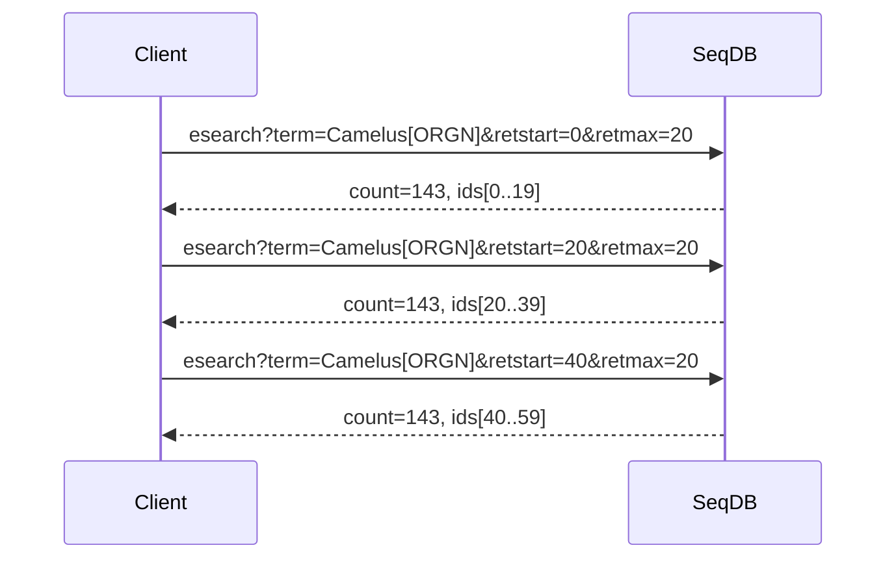
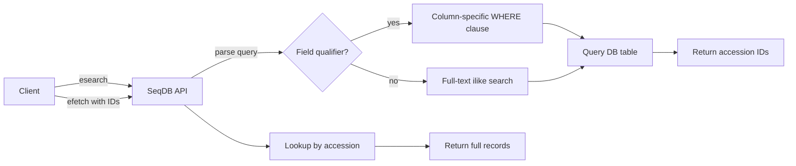

# E-utilities API

SeqDB implements a subset of the NCBI E-utilities interface, allowing you to query
internal genomic metadata using familiar Entrez syntax. If you have ever used
NCBI's `esearch`, `efetch`, or `esummary`, you already know how to query SeqDB.

!!! note "Compatibility goal"
    The API mirrors NCBI parameter names (`db`, `term`, `retstart`, `retmax`,
    `rettype`) so scripts written for NCBI can be pointed at SeqDB with minimal
    changes.

---

## Available Databases

| Database      | Internal Table | Description                          | Example Accession   |
|---------------|----------------|--------------------------------------|---------------------|
| `bioproject`  | `projects`     | Sequencing projects                  | `NFDP-PRJ-000001`  |
| `biosample`   | `samples`      | Biological samples                   | `NFDP-SAM-000042`  |
| `sra`         | `experiments`  | Experiments and associated run data  | `NFDP-EXP-000099`  |

## Searchable Fields

| Qualifier | Field Map                                                   | Applies To                    |
|-----------|-------------------------------------------------------------|-------------------------------|
| `[ORGN]`  | `biosample.organism`                                        | `biosample`                   |
| `[TITL]`  | `bioproject.title` / `biosample.organism`                   | `bioproject`, `biosample`     |
| `[PDAT]`  | `*.created_at`                                              | all databases                 |
| `[ACCN]`  | `*.internal_accession`                                      | all databases                 |

When no qualifier is provided, SeqDB performs a **full-text `ilike` search**
across every searchable column for the chosen database.

---

## Endpoints

### 1. einfo -- List Databases and Fields

**URL** `GET /api/v1/eutils/einfo` (no parameters)

```json
{
  "databases": [
    {"name": "bioproject", "description": "Sequencing projects", "searchable_fields": ["TITL", "PDAT", "ACCN"]},
    {"name": "biosample", "description": "Biological samples", "searchable_fields": ["ORGN", "TITL", "PDAT", "ACCN"]},
    {"name": "sra", "description": "Experiments and run data", "searchable_fields": ["PDAT", "ACCN"]}
  ]
}
```

```bash
curl -s "https://seqdb.nfdp.org/api/v1/eutils/einfo" | jq .
```

---

### 2. esearch -- Search and Retrieve IDs

**URL** `GET /api/v1/eutils/esearch`

| Parameter  | Required | Default | Description                            |
|------------|----------|---------|----------------------------------------|
| `db`       | yes      | --      | Database name (`bioproject`, `biosample`, `sra`) |
| `term`     | yes      | --      | Entrez query string                    |
| `retstart` | no       | `0`     | Index of first result to return        |
| `retmax`   | no       | `20`    | Maximum number of results              |
| `rettype`  | no       | `json`  | Response format (`json` or `xml`)      |

```json
{
  "esearchresult": {
    "db": "biosample",
    "count": 143,
    "retstart": 0,
    "retmax": 20,
    "idlist": ["NFDP-SAM-000001", "NFDP-SAM-000002", "NFDP-SAM-000003"],
    "querytranslation": "Camelus dromedarius[ORGN]"
  }
}
```

```bash
# Search for all camel biosamples
curl -s "https://seqdb.nfdp.org/api/v1/eutils/esearch?db=biosample&term=Camelus+dromedarius[ORGN]" | jq .

# Search bioprojects by title keyword
curl -s "https://seqdb.nfdp.org/api/v1/eutils/esearch?db=bioproject&term=genome+survey[TITL]&retmax=50" | jq .

# Paginate through results
curl -s "https://seqdb.nfdp.org/api/v1/eutils/esearch?db=biosample&term=Camelus[ORGN]&retstart=20&retmax=20" | jq .
```

---

### 3. efetch -- Fetch Full Records

**URL** `GET /api/v1/eutils/efetch`

| Parameter | Required | Default | Description                              |
|-----------|----------|---------|------------------------------------------|
| `db`      | yes      | --      | Database name                            |
| `id`      | yes      | --      | Comma-separated accession IDs            |
| `rettype` | no       | `json`  | Response format (`json` or `xml`)        |

```json
{
  "efetchresult": {
    "db": "biosample",
    "records": [
      {
        "accession": "NFDP-SAM-000001",
        "organism": "Camelus dromedarius",
        "breed": "Majaheem",
        "sex": "female",
        "tissue": "whole blood",
        "project_accession": "NFDP-PRJ-000001",
        "created_at": "2026-01-15T08:30:00Z"
      }
    ]
  }
}
```

```bash
# Fetch a single sample
curl -s "https://seqdb.nfdp.org/api/v1/eutils/efetch?db=biosample&id=NFDP-SAM-000001" | jq .

# Fetch multiple experiments
curl -s "https://seqdb.nfdp.org/api/v1/eutils/efetch?db=sra&id=NFDP-EXP-000001,NFDP-EXP-000002" | jq .

# Fetch as XML
curl -s "https://seqdb.nfdp.org/api/v1/eutils/efetch?db=bioproject&id=NFDP-PRJ-000001&rettype=xml"
```

---

### 4. esummary -- Fetch Record Summaries

Lighter than `efetch` when you only need key fields.

**URL** `GET /api/v1/eutils/esummary`

| Parameter | Required | Default | Description                              |
|-----------|----------|---------|------------------------------------------|
| `db`      | yes      | --      | Database name                            |
| `id`      | yes      | --      | Comma-separated accession IDs            |
| `rettype` | no       | `json`  | Response format (`json` or `xml`)        |

```json
{
  "esummaryresult": {
    "db": "bioproject",
    "summaries": [
      {
        "accession": "NFDP-PRJ-000001",
        "title": "Arabian Camel 1000 Genomes",
        "sample_count": 1024,
        "created_at": "2025-11-01T12:00:00Z"
      }
    ]
  }
}
```

```bash
curl -s "https://seqdb.nfdp.org/api/v1/eutils/esummary?db=bioproject&id=NFDP-PRJ-000001" | jq .
```

---

## Query Syntax

### Field Qualifiers

Append a qualifier in square brackets to restrict a term to a specific field:

```
Camelus dromedarius[ORGN]       # organism field
genome survey[TITL]             # title field
NFDP-PRJ-000001[ACCN]          # accession field
```

### Boolean Operators

Combine terms with `AND`, `OR`, and `NOT` (must be uppercase):

```
Camelus[ORGN] AND female[SEX]
Camelus[ORGN] OR Equus[ORGN]
Camelus[ORGN] NOT Camelus bactrianus[ORGN]
```

### Date Ranges

Use `[PDAT]` with a colon-separated range in `YYYY/MM/DD` format:

```
2026/01/01:2026/12/31[PDAT]
Camelus[ORGN] AND 2025/06/01:2026/03/15[PDAT]
```

### Plain Text Search

When no qualifier is supplied, SeqDB runs a case-insensitive `ilike` match
across all searchable columns in the target database:

```
dromedarius          # matches organism, title, description, etc.
whole genome         # matches anywhere in searchable text
```

---

## Pagination

Use `retstart` and `retmax` to page through large result sets.



!!! tip "Efficient bulk retrieval"
    Use `esearch` to collect all IDs first, then pass them in batches to
    `efetch` or `esummary`. This avoids re-executing the search query on
    every page.

---

## Comparison with NCBI E-utilities

| Feature                  | NCBI                              | SeqDB                             |
|--------------------------|-----------------------------------|-----------------------------------|
| Base URL                 | `eutils.ncbi.nlm.nih.gov/entrez` | `seqdb.nfdp.org/api/v1/eutils`   |
| Authentication           | API key (optional)                | Bearer token (required)           |
| Databases                | 40+ (pubmed, nuccore, ...)        | 3 (bioproject, biosample, sra)    |
| Query syntax             | Full Entrez                       | Subset (field qualifiers, booleans, dates) |
| `einfo`                  | Supported                         | Supported                         |
| `esearch`                | Supported                         | Supported                         |
| `efetch`                 | Supported                         | Supported                         |
| `esummary`               | Supported                         | Supported                         |
| `elink` / `epost`       | Supported                         | Not implemented                   |
| WebEnv / query_key       | Supported                         | Not implemented                   |
| Default `rettype`        | `xml`                             | `json`                            |
| Accession format         | PRJNA*, SAMN*, SRX*              | NFDP-PRJ-*, NFDP-SAM-*, NFDP-EXP-* |

!!! warning "No WebEnv support"
    SeqDB does not implement `epost` or the WebEnv/query_key mechanism. Use
    `retstart`/`retmax` pagination instead, or pass IDs directly to `efetch`.

---

## Integration Examples

### Python (requests)

```python
import requests

BASE = "https://seqdb.nfdp.org/api/v1/eutils"
HEADERS = {"Authorization": f"Bearer {TOKEN}"}

# Search
resp = requests.get(f"{BASE}/esearch",
    params={"db": "biosample", "term": "Camelus dromedarius[ORGN]", "retmax": 100},
    headers=HEADERS)
ids = resp.json()["esearchresult"]["idlist"]

# Fetch
resp = requests.get(f"{BASE}/efetch",
    params={"db": "biosample", "id": ",".join(ids)},
    headers=HEADERS)
for rec in resp.json()["efetchresult"]["records"]:
    print(rec["accession"], rec["organism"], rec["breed"])
```

### R (httr)

```r
library(httr)
base_url <- "https://seqdb.nfdp.org/api/v1/eutils"
token <- Sys.getenv("SEQDB_TOKEN")

res <- GET(paste0(base_url, "/esearch"),
  query = list(db = "biosample", term = "Camelus[ORGN]", retmax = 50),
  add_headers(Authorization = paste("Bearer", token)))
ids <- content(res)$esearchresult$idlist

res2 <- GET(paste0(base_url, "/efetch"),
  query = list(db = "biosample", id = paste(ids, collapse = ",")),
  add_headers(Authorization = paste("Bearer", token)))
records <- content(res2)$efetchresult$records
```

### Command Line (curl + jq)

```bash
TOKEN="your-bearer-token"
BASE="https://seqdb.nfdp.org/api/v1/eutils"

# Search → Fetch pipeline
IDS=$(curl -s -H "Authorization: Bearer $TOKEN" \
  "$BASE/esearch?db=biosample&term=Camelus[ORGN]&retmax=100" \
  | jq -r '.esearchresult.idlist | join(",")')

curl -s -H "Authorization: Bearer $TOKEN" \
  "$BASE/efetch?db=biosample&id=$IDS" \
  | jq '.efetchresult.records[] | {accession, organism, breed}'
```

---

## Request Flow



!!! tip "Combine with the samplesheet endpoint"
    Once you have identified samples via `esearch`, generate a pipeline-ready
    samplesheet for their parent project using
    `GET /api/v1/samplesheet/{project}?format=sarek`. See
    [Samplesheet Generation](../user-guide/samplesheet-generation.md).
