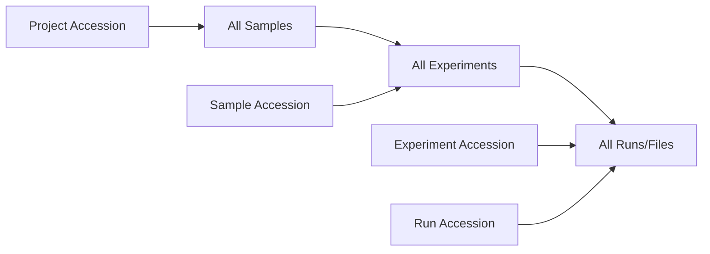

# File Reports API

The `/filereport` endpoint provides ENA-style file metadata and download URLs. Query by any accession type to get all associated files.

## Endpoint

```
GET /api/v1/filereport?accession={accession}
```

No authentication required.

## How it works

Like [ENA's file report](https://www.ebi.ac.uk/ena/portal/api/filereport), you pass any accession and the system resolves the full hierarchy to return all associated files.



## Query by accession type

### Project — get all files in a study

```bash
curl 'http://localhost:8000/api/v1/filereport?accession=NFDP-PRJ-000001'
```

### Sample — get files for one sample

```bash
curl 'http://localhost:8000/api/v1/filereport?accession=NFDP-SAM-000001'
```

### Experiment — get files for one experiment

```bash
curl 'http://localhost:8000/api/v1/filereport?accession=NFDP-EXP-000001'
```

### Run — get a single file entry

```bash
curl 'http://localhost:8000/api/v1/filereport?accession=NFDP-RUN-000001'
```

## Response format

```json
[
  {
    "run_accession": "NFDP-RUN-000001",
    "experiment_accession": "NFDP-EXP-000001",
    "sample_accession": "NFDP-SAM-000001",
    "project_accession": "NFDP-PRJ-000001",
    "organism": "Camelus dromedarius",
    "tax_id": 9838,
    "file_type": "FASTQ",
    "filename": "SAMPLE_001_R1.fastq.gz",
    "file_path": "nfdp-raw/NFDP-PRJ-000001/NFDP-SAM-000001/NFDP-RUN-000001/SAMPLE_001_R1.fastq.gz",
    "file_size": 1234567890,
    "checksum_md5": "d41d8cd98f00b204e9800998ecf8427e",
    "checksum_sha256": null,
    "download_url": "/api/v1/runs/NFDP-RUN-000001/download",
    "platform": "ILLUMINA",
    "instrument_model": "Illumina NovaSeq 6000",
    "library_strategy": "WGS",
    "library_layout": "PAIRED"
  }
]
```

### Response fields

| Field | Description |
|-------|-------------|
| `run_accession` | Run accession (file-level) |
| `experiment_accession` | Parent experiment |
| `sample_accession` | Parent sample |
| `project_accession` | Parent project |
| `organism` | Species name from sample |
| `tax_id` | NCBI taxonomy ID |
| `file_type` | `FASTQ`, `BAM`, `CRAM`, `VCF`, or `OTHER` |
| `filename` | Original filename |
| `file_path` | Storage path (bucket/project/sample/run/file) |
| `file_size` | Size in bytes |
| `checksum_md5` | MD5 hex digest |
| `checksum_sha256` | SHA-256 hex digest (if available) |
| `download_url` | Relative URL for downloading the file |
| `platform` | Sequencing platform |
| `instrument_model` | Instrument model |
| `library_strategy` | Library strategy (WGS, RNA-Seq, etc.) |
| `library_layout` | PAIRED or SINGLE |

## Comparison with ENA

=== "ENA"

    ```bash
    # Get FASTQ files for study PRJNA123456
    curl 'https://www.ebi.ac.uk/ena/portal/api/filereport?\
    accession=PRJNA123456&\
    result=read_run&\
    fields=run_accession,fastq_ftp,fastq_md5,fastq_bytes'
    ```

    Response: TSV with columns `run_accession`, `fastq_ftp`, `fastq_md5`, `fastq_bytes`

=== "SeqDB"

    ```bash
    # Get all files for project NFDP-PRJ-000001
    curl 'http://localhost:8000/api/v1/filereport?accession=NFDP-PRJ-000001'
    ```

    Response: JSON array with full metadata + download URLs

Key differences:

| Feature | ENA | SeqDB |
|---------|-----|-------|
| Format | TSV (default) | JSON |
| `result` param | Required (`read_run` or `analysis`) | Not needed (always read_run) |
| `fields` param | Optional (filter columns) | Not supported (all fields returned) |
| Download | FTP/Aspera URLs | Presigned URL via `/runs/{acc}/download` |

## Batch download recipes

### Download all files for a project

=== "Bash + jq"

    ```bash
    curl -s 'http://localhost:8000/api/v1/filereport?accession=NFDP-PRJ-000001' \
      | jq -r '.[].download_url' \
      | while read url; do
          curl -L -O "http://localhost:8000${url}"
        done
    ```

=== "Python"

    ```python
    import requests

    BASE = "http://localhost:8000/api/v1"
    files = requests.get(f"{BASE}/filereport", params={"accession": "NFDP-PRJ-000001"}).json()

    for f in files:
        print(f"Downloading {f['filename']} ({f['file_size']} bytes)...")
        resp = requests.get(f"{BASE}{f['download_url']}", allow_redirects=True)
        with open(f['filename'], 'wb') as out:
            out.write(resp.content)
    ```

=== "Parallel (xargs)"

    ```bash
    curl -s 'http://localhost:8000/api/v1/filereport?accession=NFDP-PRJ-000001' \
      | jq -r '.[].download_url' \
      | xargs -P 4 -I {} curl -L -O 'http://localhost:8000{}'
    ```

### Verify checksums

```bash
# Generate expected checksums
curl -s 'http://localhost:8000/api/v1/filereport?accession=NFDP-PRJ-000001' \
  | jq -r '.[] | "\(.checksum_md5)  \(.filename)"' > expected_md5.txt

# Verify downloads
md5sum -c expected_md5.txt
```

### Filter by sample

```bash
# Get files for a specific sample only
curl -s 'http://localhost:8000/api/v1/filereport?accession=NFDP-SAM-000003'
```
