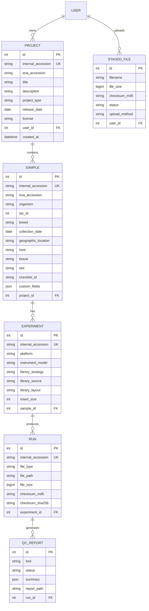

# Data Model

The SeqDB data model mirrors the ENA submission hierarchy: Project → Sample → Experiment → Run.

## Entity Relationship Diagram



## Accession format

Every entity receives a persistent internal accession:

| Entity | Format | Example |
|--------|--------|---------|
| Project | `NFDP-PRJ-NNNNNN` | `NFDP-PRJ-000001` |
| Sample | `NFDP-SAM-NNNNNN` | `NFDP-SAM-000042` |
| Experiment | `NFDP-EXP-NNNNNN` | `NFDP-EXP-000007` |
| Run | `NFDP-RUN-NNNNNN` | `NFDP-RUN-000015` |

Accessions are sequential and never reused. After ENA submission, an `ena_accession` is added alongside the internal one.

## ENA mapping

| SeqDB | ENA Equivalent | ENA Accession |
|-------|---------------|---------------|
| Project | Study | `ERP*` / `PRJ*` |
| Sample | Sample | `ERS*` / `SAM*` |
| Experiment | Experiment | `ERX*` |
| Run | Run | `ERR*` |

## Enums

### FileType

`FASTQ`, `BAM`, `CRAM`, `VCF`, `OTHER`

### Platform

`ILLUMINA`, `OXFORD_NANOPORE`, `PACBIO_SMRT`, `ION_TORRENT`, `BGISEQ`

### LibraryStrategy

`WGS`, `WXS`, `RNA_SEQ`, `AMPLICON`, `TARGETED_CAPTURE`, `OTHER`

### LibrarySource

`GENOMIC`, `TRANSCRIPTOMIC`, `METAGENOMIC`, `METATRANSCRIPTOMIC`, `VIRAL_RNA`, `OTHER`

### LibraryLayout

`PAIRED`, `SINGLE`

## Storage paths

Files in MinIO follow this path structure:

```
{bucket}/{project_accession}/{sample_accession}/{run_accession}/{filename}
```

Example:
```
nfdp-raw/NFDP-PRJ-000001/NFDP-SAM-000001/NFDP-RUN-000001/SAMPLE_001_R1.fastq.gz
```

### Buckets

| Bucket | Purpose |
|--------|---------|
| `nfdp-raw` | Original uploaded sequence files |
| `nfdp-staging` | Temporary staging area before linking |
| `nfdp-qc` | QC reports (FastQC, MultiQC) |
| `nfdp-processed` | Pipeline output files |
| `nfdp-snpchip` | SNP chip genotyping data |
