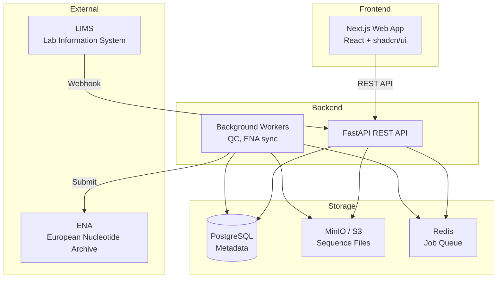
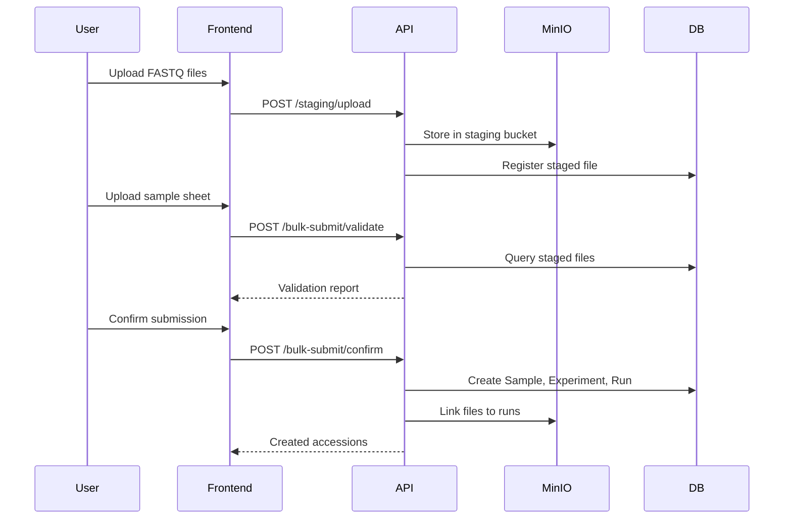
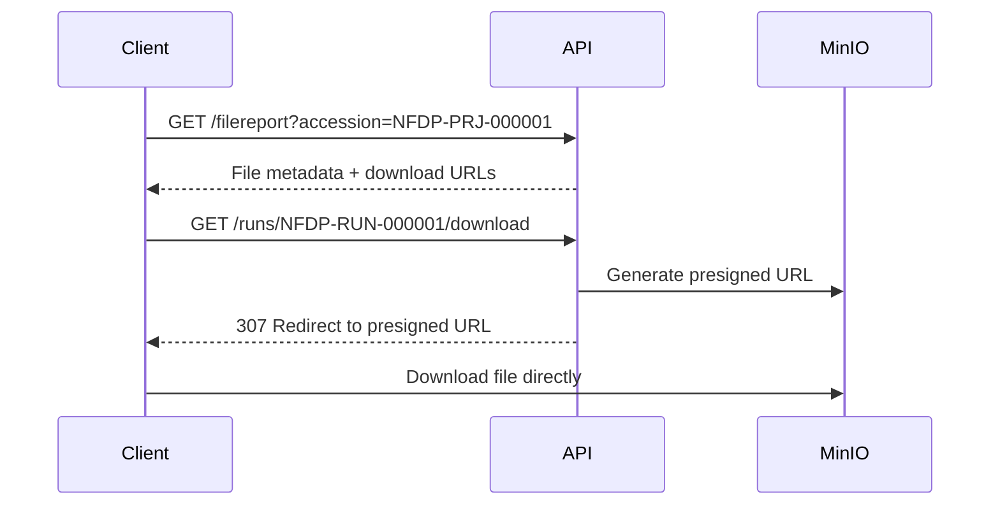

# System Overview

The SeqDB Genomic Deposition System is a full-stack web application for managing genomic data submissions.

## Architecture



## Tech Stack

| Component | Technology |
|-----------|-----------|
| Frontend | Next.js 16, React 19, TypeScript, Tailwind CSS, shadcn/ui |
| Backend | Python 3.12, FastAPI, SQLAlchemy (async), Pydantic v2 |
| Database | PostgreSQL (production), SQLite (dev) |
| Object Storage | MinIO (S3-compatible) |
| Job Queue | Redis + ARQ |
| Auth | JWT (JSON Web Tokens) |

## Data Flow

### Submission flow



### Download flow



## Directory structure

```
pathogen_genomics/
├── backend/
│   ├── app/
│   │   ├── api/v1/          # API endpoints
│   │   ├── models/          # SQLAlchemy models
│   │   ├── schemas/         # Pydantic schemas
│   │   ├── services/        # Business logic
│   │   ├── config.py        # Configuration
│   │   ├── database.py      # DB connection
│   │   └── main.py          # FastAPI app
│   └── tests/
├── frontend/
│   ├── src/
│   │   ├── app/             # Next.js pages
│   │   ├── components/      # React components
│   │   └── lib/             # API client, utilities
│   └── public/
├── docs/                    # This documentation
├── docker-compose.yml       # Local dev services
└── mkdocs.yml              # Docs configuration
```
