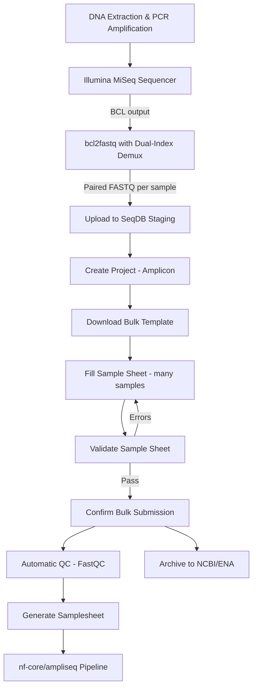

# Amplicon Sequencing

This guide covers the complete workflow for submitting 16S, 18S, and ITS amplicon sequencing data to SeqDB, from MiSeq FASTQ output through to integration with the nf-core/ampliseq pipeline.

---

## Quick Reference

| Property           | Value                                          |
|--------------------|-------------------------------------------------|
| **Platform**       | `ILLUMINA` (MiSeq, iSeq 100)                   |
| **Library Strategy** | `AMPLICON`                                    |
| **Library Source**  | `METAGENOMIC` or `GENOMIC`                     |
| **File Type**      | `FASTQ` (paired-end, typically 2x250 or 2x300 bp) |
| **Checklist**      | `ERC000011` (default) or `ERC000020` (pathogen) |
| **Pipeline Format** | `?format=generic` or `?format=fetchngs`        |
| **Typical Scale**  | 96 -- 384 samples per MiSeq run                 |

---

## End-to-End Flow



---

## Amplicon Sequencing Overview

Amplicon sequencing targets specific genomic regions using PCR primers:

| Target Gene | Use Case                           | Typical Primers         |
|-------------|-------------------------------------|-------------------------|
| **16S rRNA** | Bacterial community profiling      | 515F / 806R (V4 region) |
| **18S rRNA** | Eukaryotic diversity               | Euk1391f / EukBr        |
| **ITS**      | Fungal identification              | ITS1f / ITS2            |

!!! note "High Sample Counts"
    Amplicon runs typically multiplex 96-384 samples on a single MiSeq flow cell. The bulk submission workflow is designed for exactly this scenario -- filling one sample sheet with hundreds of rows and submitting them all at once.

---

## Step 1: Prepare Your Files

Amplicon data from MiSeq typically uses paired-end 2x250 bp or 2x300 bp reads:

```bash
bcl2fastq \
  --runfolder-dir /data/sequencer/260315_M00001_0200_000000000-XXXXX \
  --output-dir /data/amplicon/ \
  --sample-sheet SampleSheet.csv \
  --barcode-mismatches 0
```

!!! tip "Demultiplexing"
    For amplicon data, use `--barcode-mismatches 0` to minimize index hopping, which is especially important with high-multiplexing runs. Verify demultiplexing statistics before upload.

Output per sample:

```
S001_S1_L001_R1_001.fastq.gz    # Forward reads (~250-300 bp)
S001_S1_L001_R2_001.fastq.gz    # Reverse reads (~250-300 bp)
```

File sizes for amplicon data are generally small (50 MB -- 1 GB per file), making browser upload practical.

---

## Step 2: Create a Project

### Web UI

1. Navigate to **Projects** > **New Project**
2. Set **Project Type** to `Amplicon`
3. Fill in title and description (include target gene and study context)
4. Click **Create**

### CLI

```bash
seqdb login
seqdb submit --project \
  --title "Camel Gut Microbiome 16S Survey" \
  --description "16S V4 amplicon sequencing of camel gut samples across 3 regions" \
  --project-type Amplicon
```

### API

```bash
curl -X POST https://api.seqdb.nfdp.dev/api/v1/projects/ \
  -H "Authorization: Bearer $TOKEN" \
  -H "Content-Type: application/json" \
  -d '{
    "title": "Camel Gut Microbiome 16S Survey",
    "description": "16S V4 amplicon sequencing of camel gut samples across 3 regions",
    "project_type": "Amplicon"
  }'
```

---

## Step 3: Choose a Checklist

| Checklist     | Use Case                                          |
|---------------|---------------------------------------------------|
| `ERC000011`   | Default -- environmental or host-associated samples |
| `ERC000020`   | Pathogen-related amplicon studies                  |

!!! tip "Pathogen Studies"
    If your amplicon study involves clinical or pathogen-associated samples, use `ERC000020`. It includes fields for host health status, isolation source, and clinical context that are required for pathogen data archival.

---

## Step 4: Upload Files to Staging

Because amplicon FASTQ files are typically small, all three upload methods work well.

### Browser Upload (convenient for single runs)

1. Go to **Staging** > **Upload Files**
2. Select all FASTQ files from your run directory
3. Upload proceeds quickly due to small file sizes

### CLI (recommended for 96+ samples)

```bash
seqdb upload --project NFDP-PRJ-000060 \
  --files /data/amplicon/*.fastq.gz \
  --threads 8
```

### API

```bash
# Upload each file individually
for f in /data/amplicon/*.fastq.gz; do
  curl -X POST https://api.seqdb.nfdp.dev/api/v1/staging/upload \
    -H "Authorization: Bearer $TOKEN" \
    -F "file=@$f"
done
```

!!! note "Thread Count"
    With many small files, increase `--threads` to speed up uploads. For 384 samples (768 files), `--threads 8` uploads files in parallel batches.

---

## Step 5: Prepare the Bulk Sample Sheet

This is the most important step for amplicon projects, as you will typically have many samples.

### Download the Template

```bash
# CLI
seqdb template --checklist ERC000011 --output amplicon_samples.tsv

# API
curl -O 'https://api.seqdb.nfdp.dev/api/v1/bulk-submit/template/ERC000011'
```

### Required Columns

| Column               | Example                        | Required | Notes                           |
|----------------------|--------------------------------|----------|----------------------------------|
| `sample_alias`       | `GUT_001`                      | Yes      | Unique per sample               |
| `organism`           | `gut metagenome`               | Yes      | Use metagenome terms for 16S    |
| `tax_id`             | `749906`                       | Yes      | NCBI tax ID for the metagenome  |
| `collection_date`    | `2026-01-20`                   | Yes      |                                  |
| `geographic_location`| `Saudi Arabia:Al-Ahsa`         | Yes      |                                  |
| `filename_forward`   | `GUT_001_R1.fastq.gz`         | Yes      |                                  |
| `filename_reverse`   | `GUT_001_R2.fastq.gz`         | Yes      |                                  |
| `library_strategy`   | `AMPLICON`                     | Yes      |                                  |
| `library_source`     | `METAGENOMIC`                  | Yes      | `GENOMIC` for targeted species  |
| `library_layout`     | `PAIRED`                       | Yes      |                                  |
| `platform`           | `ILLUMINA`                     | Yes      |                                  |
| `instrument_model`   | `Illumina MiSeq`              | Yes      |                                  |

### Custom Fields for Amplicon Data

Use `custom_fields` to record primer and target gene information:

```json
{
  "target_gene": "16S rRNA",
  "target_subfragment": "V4",
  "pcr_primers": "515F/806R",
  "forward_primer_sequence": "GTGYCAGCMGCCGCGGTAA",
  "reverse_primer_sequence": "GGACTACNVGGGTWTCTAAT",
  "sample_type": "fecal"
}
```

!!! warning "Primer Information"
    Recording primer sequences is strongly recommended. Downstream tools like DADA2 and QIIME2 use primer sequences for read trimming. If primers are not recorded, users must determine them from the library prep protocol.

### Example Sample Sheet (96-sample plate)

```tsv
sample_alias	organism	tax_id	collection_date	geographic_location	filename_forward	filename_reverse	library_strategy	library_source	library_layout	platform	instrument_model	custom_fields
GUT_001	gut metagenome	749906	2026-01-20	Saudi Arabia:Al-Ahsa	GUT_001_R1.fastq.gz	GUT_001_R2.fastq.gz	AMPLICON	METAGENOMIC	PAIRED	ILLUMINA	Illumina MiSeq	{"target_gene":"16S rRNA","target_subfragment":"V4","pcr_primers":"515F/806R"}
GUT_002	gut metagenome	749906	2026-01-20	Saudi Arabia:Al-Ahsa	GUT_002_R1.fastq.gz	GUT_002_R2.fastq.gz	AMPLICON	METAGENOMIC	PAIRED	ILLUMINA	Illumina MiSeq	{"target_gene":"16S rRNA","target_subfragment":"V4","pcr_primers":"515F/806R"}
GUT_003	gut metagenome	749906	2026-01-20	Saudi Arabia:Riyadh	GUT_003_R1.fastq.gz	GUT_003_R2.fastq.gz	AMPLICON	METAGENOMIC	PAIRED	ILLUMINA	Illumina MiSeq	{"target_gene":"16S rRNA","target_subfragment":"V4","pcr_primers":"515F/806R"}
```

!!! tip "Filling Large Sheets"
    For 96+ samples with identical metadata (same organism, primers, instrument), fill one row completely, then copy it down and change only `sample_alias`, `filename_forward`, `filename_reverse`, and sample-specific fields like `geographic_location`. Spreadsheet editors make this fast.

---

## Step 6: Validate the Sample Sheet

Validation is especially important for amplicon projects due to the high sample count.

### CLI

```bash
seqdb validate --file amplicon_samples.tsv --checklist ERC000011
```

### API

```bash
curl -X POST https://api.seqdb.nfdp.dev/api/v1/bulk-submit/validate \
  -H "Authorization: Bearer $TOKEN" \
  -F "file=@amplicon_samples.tsv" \
  -F "checklist_id=ERC000011"
```

Common validation errors for amplicon data:

| Error                   | Typical Cause                               |
|-------------------------|---------------------------------------------|
| `duplicate_sample_alias` | Same alias used for multiple rows          |
| `file_not_found`        | Filename typo or file not yet uploaded      |
| `invalid_tax_id`        | Using species ID instead of metagenome ID   |

!!! note "Metagenome Taxonomy"
    For 16S/18S amplicon studies, use the appropriate metagenome taxonomy ID, not the host organism. For example, use `749906` (gut metagenome) instead of `9838` (Camelus dromedarius). Browse valid metagenome terms at [NCBI Taxonomy](https://www.ncbi.nlm.nih.gov/taxonomy/?term=metagenome).

---

## Step 7: Confirm Submission

### CLI

```bash
seqdb submit --file amplicon_samples.tsv \
  --project NFDP-PRJ-000060 \
  --checklist ERC000011
```

### API

```bash
curl -X POST https://api.seqdb.nfdp.dev/api/v1/bulk-submit/confirm \
  -H "Authorization: Bearer $TOKEN" \
  -F "file=@amplicon_samples.tsv" \
  -F "project_accession=NFDP-PRJ-000060" \
  -F "checklist_id=ERC000011"
```

Response for a 96-sample submission:

```json
{
  "status": "created",
  "samples": ["NFDP-SAM-000300", "...", "NFDP-SAM-000395"],
  "experiments": ["NFDP-EXP-000300", "...", "NFDP-EXP-000395"],
  "runs": ["NFDP-RUN-000600", "...", "NFDP-RUN-000791"]
}
```

---

## Step 8: Quality Control

FastQC runs automatically. For amplicon data, focus on:

- **Read length distribution** -- Should be uniform (all reads same length before trimming)
- **Per-base quality** -- Quality drop at the end of reads is normal for 2x300 bp MiSeq
- **Adapter content** -- Should be minimal if reads are shorter than the amplicon

```bash
# Check QC for a specific run
curl 'https://api.seqdb.nfdp.dev/api/v1/runs/NFDP-RUN-000600/qc'

# Check overall project status
seqdb status --project NFDP-PRJ-000060
```

!!! warning "Quality Drop in R2"
    MiSeq 2x300 bp runs commonly show quality degradation in the last 50-100 bp of R2 reads. This is expected and handled by downstream tools (DADA2 truncation). It should not be treated as a QC failure.

---

## Step 9: Generate Pipeline Samplesheet

### Generic Format

```bash
# CLI
seqdb fetch --project NFDP-PRJ-000060 --format generic --output samplesheet.tsv

# API
curl 'https://api.seqdb.nfdp.dev/api/v1/samplesheet/NFDP-PRJ-000060?format=generic' \
  -o samplesheet.tsv
```

### fetchngs Format

```bash
curl 'https://api.seqdb.nfdp.dev/api/v1/samplesheet/NFDP-PRJ-000060?format=fetchngs' \
  -o samplesheet.csv
```

### Integration with nf-core/ampliseq

The generic samplesheet can be adapted for [nf-core/ampliseq](https://nf-co.re/ampliseq):

```bash
# Download samplesheet
seqdb fetch --project NFDP-PRJ-000060 --format generic --output samples.tsv

# Run ampliseq pipeline
nextflow run nf-core/ampliseq \
  --input samples.tsv \
  --FW_primer "GTGYCAGCMGCCGCGGTAA" \
  --RV_primer "GGACTACNVGGGTWTCTAAT" \
  --dada_ref_taxonomy silva=138 \
  -profile singularity
```

!!! tip "Primer Trimming"
    Always provide `--FW_primer` and `--RV_primer` to nf-core/ampliseq. The pipeline uses Cutadapt to remove primer sequences before ASV inference. If primers are already trimmed, use `--skip_cutadapt`.

---

## Step 10: Archive to NCBI/ENA

### Submit

```bash
curl -X POST https://api.seqdb.nfdp.dev/api/v1/ncbi/submit/NFDP-PRJ-000060 \
  -H "Authorization: Bearer $TOKEN"
```

### Check Status

```bash
curl 'https://api.seqdb.nfdp.dev/api/v1/ncbi/status/NFDP-PRJ-000060' \
  -H "Authorization: Bearer $TOKEN"
```

!!! note "SRA Submission for Amplicon Data"
    NCBI/SRA requires that amplicon submissions include the target gene and primer information in the experiment metadata. SeqDB extracts this from `custom_fields` during archival. Ensure your primer data is populated before submitting.

---

## Complete CLI Workflow

```bash
# 1. Authenticate
seqdb login

# 2. Download template
seqdb template --checklist ERC000011 --output amplicon_samples.tsv

# 3. Edit the template (96+ rows for a typical MiSeq run)
# ... fill in sample metadata, set library_strategy=AMPLICON ...

# 4. Upload all FASTQ files
seqdb upload --project NFDP-PRJ-000060 \
  --files /data/amplicon/*.fastq.gz \
  --threads 8

# 5. Validate (important with many samples)
seqdb validate --file amplicon_samples.tsv --checklist ERC000011

# 6. Submit
seqdb submit --file amplicon_samples.tsv \
  --project NFDP-PRJ-000060 \
  --checklist ERC000011

# 7. Check status
seqdb status --project NFDP-PRJ-000060

# 8. Generate samplesheet
seqdb fetch --project NFDP-PRJ-000060 --format generic --output samplesheet.tsv

# 9. Run analysis
nextflow run nf-core/ampliseq \
  --input samplesheet.tsv \
  --FW_primer "GTGYCAGCMGCCGCGGTAA" \
  --RV_primer "GGACTACNVGGGTWTCTAAT" \
  --dada_ref_taxonomy silva=138
```

---

## Troubleshooting

| Issue | Cause | Fix |
|-------|-------|-----|
| `duplicate_sample_alias` | Copy-paste error in large sheet | Ensure every row has a unique `sample_alias` |
| `invalid_tax_id` for metagenome | Used host organism ID | Use metagenome tax ID (e.g., `749906` for gut metagenome) |
| Low read count per sample | Over-multiplexing or uneven pooling | Check demux stats; repool and re-sequence if needed |
| Pipeline fails on primer trimming | Primers already removed or wrong sequences | Use `--skip_cutadapt` or correct the primer sequences |
| Many `file_not_found` errors | Filename mismatch between sheet and staging | Check for extra whitespace or case differences in filenames |
