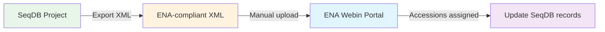
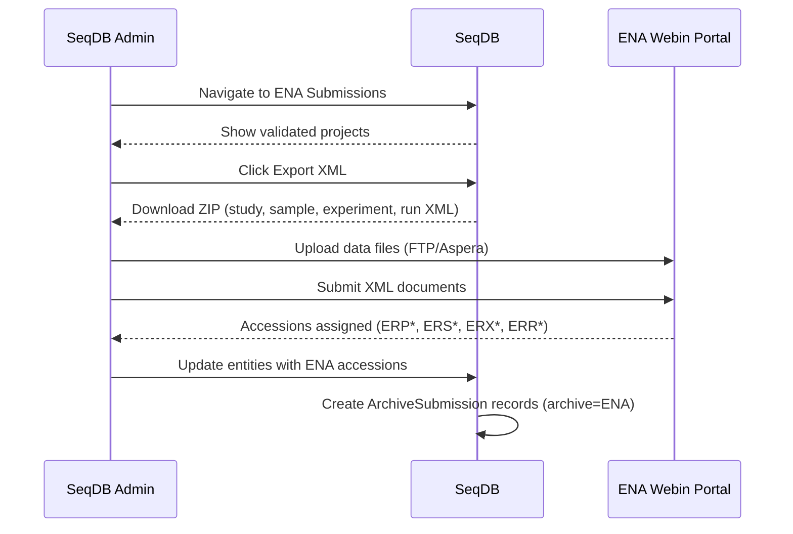

# ENA Submission

This guide covers the semi-automated workflow for submitting SeqDB projects to the European Nucleotide Archive (ENA), including XML export, file transfer, and accession tracking.

---

## Overview

ENA submission in SeqDB is currently **semi-automated**. SeqDB generates ENA-compliant XML from validated project metadata, which is then uploaded manually to the ENA Webin portal. Full automation is planned for a future release.



---

## Prerequisites

| Requirement                    | Details                                                    |
|--------------------------------|------------------------------------------------------------|
| **Validated project**          | All samples must pass checklist validation                 |
| **ENA Webin account**          | Register at [ENA Webin](https://www.ebi.ac.uk/ena/submit/webin/) |
| **Files uploaded to SeqDB**    | All runs must have associated files                        |
| **ENA-compatible file formats**| FASTQ, BAM, CRAM                                          |

!!! note "File format restrictions"
    ENA accepts FASTQ, BAM, and CRAM for sequencing data. IDAT, BED/BIM/FAM, PED/MAP, and CSV are not supported by ENA. For genotyping projects, use the [NCBI submission](ncbi-submission.md) route instead.

---

## Step-by-Step Workflow

### 1. Validate the project

Navigate to the **Project detail page** and confirm all samples show green validation status. Resolve any blocking errors.

!!! warning "Validation is mandatory"
    The Export XML button is only available for projects that have passed validation.

### 2. Export XML from SeqDB

=== "Web UI"

    1. Navigate to **Admin** > **ENA Submissions**.
    2. Locate your project in the validated submissions list.
    3. Click **Export XML** to download a ZIP file.

=== "API"

    ```bash
    curl -H "Authorization: Bearer $TOKEN" \
         "https://seqdb.nfdp.org/api/v1/ena/export/NFDP-PRJ-00042" \
         -o ena_submission_NFDP-PRJ-00042.zip
    ```

The ZIP contains four XML files:

| File               | ENA object     | Source entity      |
|--------------------|----------------|--------------------|
| `study.xml`        | Study          | SeqDB Project      |
| `sample.xml`       | Sample         | All project samples|
| `experiment.xml`   | Experiment     | Library + platform |
| `run.xml`          | Run            | Files + checksums  |

### 3. Transfer data files to ENA

Raw files must be uploaded separately to ENA. SeqDB does not handle this transfer.

!!! tip "ENA upload methods"
    - **FTP**: `ftp webin2.ebi.ac.uk` (standard, works behind most firewalls)
    - **Aspera**: `ascp -QT -l 300m -L- file.fastq.gz Webin-XXXXX@fasp.sra.ebi.ac.uk:` (faster for large files)

```bash
# FTP upload
ftp webin2.ebi.ac.uk
put sample_001_R1.fastq.gz
put sample_001_R2.fastq.gz

# Aspera upload
ascp -QT -l 300m -L- sample_001_R1.fastq.gz Webin-XXXXX@fasp.sra.ebi.ac.uk:
```

!!! note "File checksums"
    SeqDB stores MD5 checksums in `run.xml`. If you re-compress files before ENA upload, checksums will not match and ENA will reject the submission.

### 4. Submit XML to ENA Webin

=== "Webin Portal"

    1. Log in to [ENA Webin](https://www.ebi.ac.uk/ena/submit/webin/).
    2. Select **Submit XMLs**.
    3. Upload all four XML files and click **Submit**.

=== "Webin-CLI"

    ```bash
    java -jar webin-cli.jar -context reads -manifest manifest.txt \
        -userName Webin-XXXXX -password *** -validate

    java -jar webin-cli.jar -context reads -manifest manifest.txt \
        -userName Webin-XXXXX -password *** -submit
    ```

### 5. Record ENA accessions in SeqDB

After ENA assigns accessions, update SeqDB records:

```bash
curl -X PATCH -H "Authorization: Bearer $TOKEN" \
     -H "Content-Type: application/json" \
     -d '{"ena_accession": "ERP123456"}' \
     "https://seqdb.nfdp.org/api/v1/projects/NFDP-PRJ-00042"

curl -X PATCH -H "Authorization: Bearer $TOKEN" \
     -H "Content-Type: application/json" \
     -d '{"ena_accession": "ERS1234567"}' \
     "https://seqdb.nfdp.org/api/v1/samples/NFDP-SAM-00301"
```

---

## ENA Accession Mapping

| SeqDB entity | SeqDB accession | ENA prefix | Field           |
|--------------|-----------------|------------|-----------------|
| Project      | `NFDP-PRJ-*`   | `ERP*`     | `ena_accession` |
| Sample       | `NFDP-SAM-*`   | `ERS*`     | `ena_accession` |
| Experiment   | `NFDP-EXP-*`   | `ERX*`     | `ena_accession` |
| Run          | `NFDP-RUN-*`   | `ERR*`     | `ena_accession` |

!!! note "Secondary accessions"
    ENA also assigns secondary accessions (e.g., `PRJEB*`, `SAMEA*`). SeqDB stores the primary format listed above.

---

## Submission Lifecycle



---

## Status Tracking

ENA submissions are tracked via `ArchiveSubmission` records with `archive="ENA"`:

| Field              | Description                              |
|--------------------|------------------------------------------|
| `archive`          | Always `"ENA"`                           |
| `entity_type`      | `project`, `sample`, `experiment`, `run` |
| `entity_accession` | SeqDB accession (`NFDP-*`)              |
| `archive_accession`| ENA accession (`ERP*`, `ERS*`, etc.)    |
| `status`           | `completed` (once accession is recorded) |
| `created_at`       | Timestamp of record creation             |

---

## XML Structure Example

The exported XML follows ENA schema specifications. A condensed example of `study.xml`:

```xml
<STUDY_SET>
  <STUDY alias="NFDP-PRJ-00042">
    <DESCRIPTOR>
      <STUDY_TITLE>Dairy cattle WGS 2026</STUDY_TITLE>
      <STUDY_TYPE existing_study_type="Whole Genome Sequencing"/>
    </DESCRIPTOR>
  </STUDY>
</STUDY_SET>
```

The other files (`sample.xml`, `experiment.xml`, `run.xml`) follow the same pattern, mapping SeqDB entity fields to ENA XML elements with aliases matching SeqDB accessions.

---

## Comparison: NCBI vs ENA

| Aspect                  | NCBI                              | ENA                                  |
|-------------------------|-----------------------------------|--------------------------------------|
| **Automation**          | Fully automated                   | Semi-automated (XML export + manual) |
| **Submission trigger**  | Single API call or button         | Export XML, upload to Webin          |
| **File transfer**       | Handled by SeqDB                  | Manual (FTP/Aspera)                  |
| **Status polling**      | Automatic background poller       | Manual check on Webin                |
| **Accession writeback** | Automatic                         | Manual via API or UI                 |
| **Best for**            | Hands-off pipelines               | Institutions using ENA Webin         |

!!! tip "Dual submission"
    You can submit to both NCBI and ENA. SeqDB tracks accessions independently via `ncbi_accession` and `ena_accession` fields.

---

## Future: Full Automation

Planned features for full ENA automation:

- Direct Webin REST API integration (no manual upload)
- Automatic file transfer from MinIO to ENA FTP/Aspera
- Background status polling (matching NCBI poller behaviour)
- Automatic `ena_accession` writeback

!!! note "Timeline"
    Full ENA automation is on the roadmap but does not have a confirmed release date. The current semi-automated workflow is stable for production use.

---

## Common Issues

!!! warning "Checksum mismatch"
    If files are re-compressed after uploading to SeqDB, MD5 checksums in `run.xml` will not match. Always transfer the exact files registered in SeqDB.

!!! warning "Unsupported file types"
    ENA does not accept IDAT, BED/BIM/FAM, PED/MAP, or CSV. For genotyping data, use NCBI or submit only VCF files.

!!! tip "Validate before submitting"
    Always run `webin-cli -validate` before `-submit` to catch errors locally.

---

## Further Reading

- [NCBI Submission Guide](ncbi-submission.md) -- Automated alternative to ENA
- [SNP Chip Genotyping](snpchip.md) -- Genotyping data workflow
- [API Overview](../api/overview.md) -- Full API reference
- [ENA Documentation](https://ena-docs.readthedocs.io/) -- Official ENA docs
