# Hi-C Sequencing

Submit Hi-C chromatin conformation capture data for chromosome-level genome assembly or 3D genome architecture studies.

## Quick Reference

| Field | Value |
|-------|-------|
| **Project type** | Other (or WGS if scaffolding a genome assembly) |
| **Platform** | `HI_C` |
| **Library strategy** | `OTHER` |
| **Library source** | `GENOMIC` |
| **Library layout** | `PAIRED` (always) |
| **File types** | FASTQ (paired-end) |
| **Checklist** | `ERC000011` (default) or `ERC000055` (farm animal) |
| **Samplesheet format** | `?format=generic` |
| **Downstream tools** | HiC-Pro, Juicer, 3D-DNA, SALSA2 |

## When to Use This Guide

Hi-C captures chromosome-level proximity information through cross-linking, restriction enzyme digestion, and ligation. Common use cases:

- **Genome scaffolding** — ordering and orienting contigs into chromosome-level assemblies
- **3D genome architecture** — mapping chromatin interactions, TADs, compartments
- **Paired with WGS** — Hi-C data typically supplements a WGS de novo assembly project

!!! tip "Companion WGS project"
    Hi-C is almost always paired with a WGS project for the same organism. Register your WGS data in a separate SeqDB project, then reference both projects when publishing your assembly.

## Key Metadata Fields

| Field | Required | Description |
|-------|----------|-------------|
| `organism` | Yes | Species name (e.g., "Camelus dromedarius") |
| `tax_id` | Yes | NCBI taxonomy ID |
| `restriction_enzyme` | Recommended | Enzyme used (e.g., "DpnII", "MboI", "HindIII", "Arima") |
| `cross_linking_protocol` | Recommended | Cross-linking method (e.g., "formaldehyde 1%") |
| `collection_date` | Recommended | Date of sample collection |
| `tissue` | Recommended | Tissue type used for Hi-C library |
| `breed` | ERC000055 | Required for farm animal checklist |

!!! note "Custom fields for Hi-C"
    `restriction_enzyme` and `cross_linking_protocol` are not standard ENA fields. Add them via the `custom_fields` column in your TSV or through the Web UI custom metadata panel.

## Workflow

```mermaid
flowchart LR
    A[Cross-link<br/>chromatin] --> B[Restriction<br/>enzyme digest]
    B --> C[Proximity<br/>ligation]
    C --> D[Library prep &<br/>Illumina sequencing]
    D --> E[Upload paired FASTQ<br/>to SeqDB staging]
    E --> F[Fill template<br/>platform=HI_C]
    F --> G[Validate & confirm]
    G --> H[Accessions created]
    H --> I[Export samplesheet]
    I --> J[HiC-Pro / Juicer /<br/>3D-DNA analysis]
```



## Submission via Web UI

1. Go to **Submit** → **New Project** — set project type to **Other** (or **WGS** if scaffolding)
2. Navigate to the project page and click **Bulk Upload**
3. Select checklist `ERC000011` (or `ERC000055` for livestock)
4. Download the template and fill metadata for each Hi-C library
5. Set `platform` to `HI_C`, `library_strategy` to `OTHER`, `library_layout` to `PAIRED`
6. Upload paired FASTQ files via the staging area
7. Upload the TSV, review validation, and click **Confirm**

!!! warning "Always paired-end"
    Hi-C reads must be paired — each read mate comes from one side of the ligation junction. Set `library_layout=PAIRED` and provide both `filename_forward` and `filename_reverse`. Single-end Hi-C data will fail validation.

## Submission via CLI

### 1. Authenticate

```bash
seqdb login --url https://api.seqdb.nfdp.dev --email you@example.com
```

### 2. Download and fill the template

```bash
seqdb template ERC000011 --output hic_samples.tsv
```

For each row, set the Hi-C-specific fields:

```
platform          → HI_C
library_strategy  → OTHER
library_layout    → PAIRED
library_source    → GENOMIC
```

### 3. Validate

```bash
seqdb validate hic_samples.tsv --checklist ERC000011
```

### 4. Submit

```bash
seqdb submit hic_samples.tsv \
  --checklist ERC000011 \
  --project NFDP-PRJ-000055 \
  --files ./hic_reads/ \
  --threads 4
```

### 5. Export samplesheet

```bash
seqdb fetch samplesheet NFDP-PRJ-000055 --format generic --output hic_samplesheet.csv
```

## Submission via API

### Upload paired FASTQ files

```bash
for f in ./hic_reads/*.fastq.gz; do
  curl -X POST https://api.seqdb.nfdp.dev/api/v1/staging/upload \
    -H "Authorization: Bearer $TOKEN" \
    -F "file=@$f"
done
```

### Validate

```bash
curl -X POST https://api.seqdb.nfdp.dev/api/v1/bulk-submit/validate \
  -H "Authorization: Bearer $TOKEN" \
  -F "file=@hic_samples.tsv" \
  -F "checklist_id=ERC000011"
```

### Confirm

```bash
curl -X POST https://api.seqdb.nfdp.dev/api/v1/bulk-submit/confirm \
  -H "Authorization: Bearer $TOKEN" \
  -F "file=@hic_samples.tsv" \
  -F "project_accession=NFDP-PRJ-000055" \
  -F "checklist_id=ERC000011"
```

### Retrieve samplesheet

```bash
curl -s "https://api.seqdb.nfdp.dev/api/v1/samplesheet/NFDP-PRJ-000055?format=generic" \
  -H "Authorization: Bearer $TOKEN" \
  -o hic_samplesheet.csv
```

## Analysis Tools

There is no standard nf-core Hi-C pipeline yet. Common analysis tools:

| Tool | Use case | Input |
|------|----------|-------|
| **HiC-Pro** | Full Hi-C processing (mapping, filtering, contact maps) | Paired FASTQ |
| **Juicer** | Contact map generation, loop calling | Paired FASTQ |
| **3D-DNA** | Scaffolding draft assemblies with Hi-C | Paired FASTQ + draft assembly |
| **SALSA2** | Scaffolding with Hi-C and long reads | BAM + draft assembly |
| **cooler** | Contact matrix storage and analysis | Pairs files |

!!! tip "Scaffolding workflow"
    For chromosome-level assembly: (1) assemble contigs from WGS data, (2) map Hi-C reads to contigs with HiC-Pro or Juicer, (3) scaffold with 3D-DNA or SALSA2, (4) manually curate in Juicebox.

## NCBI Submission

```bash
# Submit to NCBI/SRA
curl -X POST "https://api.seqdb.nfdp.dev/api/v1/ncbi/submit/NFDP-PRJ-000055" \
  -H "Authorization: Bearer $TOKEN"

# Check status
curl -s "https://api.seqdb.nfdp.dev/api/v1/ncbi/status/NFDP-PRJ-000055" \
  -H "Authorization: Bearer $TOKEN"
```

## Example TSV Row

```tsv
sample_alias	organism	tax_id	tissue	collection_date	platform	library_strategy	library_source	library_layout	filename_forward	filename_reverse
DROM_HIC_001	Camelus dromedarius	9838	liver	2026-01-20	HI_C	OTHER	GENOMIC	PAIRED	DROM_HIC_001_R1.fastq.gz	DROM_HIC_001_R2.fastq.gz
DROM_HIC_002	Camelus dromedarius	9838	muscle	2026-01-20	HI_C	OTHER	GENOMIC	PAIRED	DROM_HIC_002_R1.fastq.gz	DROM_HIC_002_R2.fastq.gz
```
