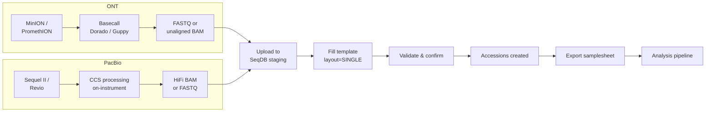

# Long-Read Sequencing (ONT & PacBio HiFi)

Submit long-read data from Oxford Nanopore or PacBio HiFi instruments. Both technologies produce single-end reads in FASTQ or BAM format, but differ in platform settings, metadata, and downstream pipelines.

## Quick Reference

| Field | Oxford Nanopore | PacBio HiFi |
|-------|----------------|-------------|
| **Platform** | `OXFORD_NANOPORE` | `PACBIO_SMRT` |
| **Instruments** | MinION, GridION, PromethION | Sequel II, Sequel IIe, Revio |
| **Library strategy** | `WGS` | `WGS` |
| **Library source** | `GENOMIC` | `GENOMIC` |
| **Library layout** | `SINGLE` (always) | `SINGLE` (always) |
| **File types** | FASTQ (basecalled), BAM (unaligned) | BAM (HiFi/CCS), FASTQ |
| **Checklist** | `ERC000011` or `ERC000055` | `ERC000011` or `ERC000055` |
| **Samplesheet format** | `?format=generic` | `?format=generic` |
| **Downstream pipeline** | nf-core/nanoseq | Custom / pbbioconda |

## When to Use This Guide

Long-read sequencing produces reads from 1 kb to over 100 kb, enabling:

- De novo genome assembly with high contiguity
- Structural variant detection
- Full-length transcript sequencing (cDNA/dRNA)
- Methylation calling (native DNA)
- Phased diploid assembly

!!! tip "Fewer but larger files"
    Long-read runs typically produce fewer files than Illumina but each file can be much larger (10-100 GB). Plan staging uploads accordingly and use `--threads` to parallelize.

---

## Oxford Nanopore (ONT)

### Overview

ONT sequencers (MinION, GridION, PromethION) generate raw signal data (FAST5/POD5) that is basecalled by Guppy or Dorado into FASTQ or unaligned BAM. SeqDB accepts the basecalled output.

### Key Metadata

| Field | Required | Description |
|-------|----------|-------------|
| `organism` | Yes | Species name |
| `tax_id` | Yes | NCBI taxonomy ID |
| `platform` | Yes | `OXFORD_NANOPORE` |
| `instrument_model` | Recommended | MinION, GridION, PromethION |
| `library_layout` | Yes | `SINGLE` |
| `flowcell_type` | Recommended | e.g., FLO-MIN114, FLO-PRO114M (via `custom_fields`) |
| `basecaller` | Recommended | e.g., Dorado, Guppy (via `custom_fields`) |
| `basecaller_version` | Recommended | e.g., 0.5.1 (via `custom_fields`) |

!!! note "Custom fields for ONT metadata"
    `flowcell_type`, `basecaller`, and `basecaller_version` are stored as custom fields. In the TSV template, add columns prefixed with `custom_` or use the `custom_fields` JSON column: `{"flowcell_type": "FLO-PRO114M", "basecaller": "Dorado", "basecaller_version": "0.5.1"}`.

### File Types

- **FASTQ** — Basecalled reads (most common). One `.fastq.gz` per sample or per run.
- **BAM** — Unaligned BAM from Dorado with move tables and modified base tags. Preferred for methylation workflows.

### ONT Submission Example (CLI)

```bash
# Download template
seqdb template ERC000011 --output ont_samples.tsv

# Submit
seqdb submit ont_samples.tsv \
  --checklist ERC000011 \
  --project NFDP-PRJ-000060 \
  --files ./ont_fastq/ \
  --threads 4
```

---

## PacBio HiFi

### Overview

PacBio HiFi (CCS) reads are generated on Sequel II, Sequel IIe, or Revio instruments. The circular consensus sequencing approach produces reads with >Q20 accuracy at 10-25 kb length. Output is typically HiFi BAM or FASTQ.

### Key Metadata

| Field | Required | Description |
|-------|----------|-------------|
| `organism` | Yes | Species name |
| `tax_id` | Yes | NCBI taxonomy ID |
| `platform` | Yes | `PACBIO_SMRT` |
| `instrument_model` | Recommended | Sequel II, Sequel IIe, Revio |
| `library_layout` | Yes | `SINGLE` |
| `chemistry_version` | Recommended | e.g., Sequel II 2.0 (via `custom_fields`) |
| `movie_time` | Recommended | e.g., 30 (hours, via `custom_fields`) |

!!! note "Custom fields for PacBio metadata"
    `chemistry_version` and `movie_time` are not standard ENA fields. Add them via `custom_fields` in the TSV: `{"chemistry_version": "Sequel II 2.0", "movie_time": "30"}`.

### File Types

- **BAM** — HiFi/CCS reads in unaligned BAM format. This is the standard PacBio output and the preferred submission format.
- **FASTQ** — Converted from BAM. Acceptable but loses per-read quality metadata.

!!! warning "Use BAM when possible"
    PacBio HiFi BAM files contain kinetics data and per-read quality metrics that are lost when converting to FASTQ. Submit BAM unless your downstream pipeline specifically requires FASTQ.

### PacBio Submission Example (CLI)

```bash
# Download template
seqdb template ERC000011 --output pacbio_samples.tsv

# Submit
seqdb submit pacbio_samples.tsv \
  --checklist ERC000011 \
  --project NFDP-PRJ-000061 \
  --files ./hifi_bam/ \
  --threads 4
```

---

## Workflow



## Submission via Web UI

1. Go to **Submit** → **New Project**
2. Navigate to the project and click **Bulk Upload**
3. Select checklist (`ERC000011` or `ERC000055`)
4. Download template — set `platform` to `OXFORD_NANOPORE` or `PACBIO_SMRT`
5. Set `library_layout` to `SINGLE` for all rows
6. Leave `filename_reverse` and `md5_reverse` empty (single-end data)
7. Upload files via the staging area — note that long-read files can be large
8. Upload TSV, review validation, click **Confirm**

!!! tip "Large file uploads"
    For files over 5 GB, the staging endpoint uses multipart upload with presigned URLs. The Web UI handles this automatically. For the CLI, use `--threads` to parallelize chunk uploads.

## Submission via API

### Upload files

```bash
# ONT example — one FASTQ per sample
curl -X POST https://api.seqdb.nfdp.dev/api/v1/staging/upload \
  -H "Authorization: Bearer $TOKEN" \
  -F "file=@SAMPLE_ONT_001.fastq.gz"

# PacBio example — one HiFi BAM per sample
curl -X POST https://api.seqdb.nfdp.dev/api/v1/staging/upload \
  -H "Authorization: Bearer $TOKEN" \
  -F "file=@SAMPLE_PB_001.hifi_reads.bam"
```

### Validate

```bash
curl -X POST https://api.seqdb.nfdp.dev/api/v1/bulk-submit/validate \
  -H "Authorization: Bearer $TOKEN" \
  -F "file=@long_read_samples.tsv" \
  -F "checklist_id=ERC000011"
```

### Confirm

```bash
curl -X POST https://api.seqdb.nfdp.dev/api/v1/bulk-submit/confirm \
  -H "Authorization: Bearer $TOKEN" \
  -F "file=@long_read_samples.tsv" \
  -F "project_accession=NFDP-PRJ-000060" \
  -F "checklist_id=ERC000011"
```

### Retrieve samplesheet

```bash
curl -s "https://api.seqdb.nfdp.dev/api/v1/samplesheet/NFDP-PRJ-000060?format=generic" \
  -H "Authorization: Bearer $TOKEN" \
  -o samplesheet.csv
```

## Pipeline Integration

### ONT — nf-core/nanoseq

```bash
seqdb fetch samplesheet NFDP-PRJ-000060 --format generic --output ont_sheet.csv

nextflow run nf-core/nanoseq \
  --input ont_sheet.csv \
  --protocol DNA \
  --outdir results/ \
  -profile docker
```

### PacBio — Custom workflows

There is no standard nf-core pipeline for PacBio HiFi assembly yet. Common tools:

| Tool | Use case |
|------|----------|
| **hifiasm** | De novo assembly from HiFi reads |
| **pbmm2** | HiFi read alignment |
| **DeepVariant** | Variant calling from HiFi alignments |
| **pbsv** | Structural variant detection |
| **jasmine** | SV merging across samples |

```bash
# Example: assemble with hifiasm
seqdb fetch samplesheet NFDP-PRJ-000061 --format generic --output pb_sheet.csv
hifiasm -o asm -t 32 SAMPLE_PB_001.hifi_reads.bam
```

## NCBI Submission

```bash
# Submit ONT project
curl -X POST "https://api.seqdb.nfdp.dev/api/v1/ncbi/submit/NFDP-PRJ-000060" \
  -H "Authorization: Bearer $TOKEN"

# Submit PacBio project
curl -X POST "https://api.seqdb.nfdp.dev/api/v1/ncbi/submit/NFDP-PRJ-000061" \
  -H "Authorization: Bearer $TOKEN"

# Check status
curl -s "https://api.seqdb.nfdp.dev/api/v1/ncbi/status/NFDP-PRJ-000060" \
  -H "Authorization: Bearer $TOKEN"
```

## Example TSV Rows

### ONT

```tsv
sample_alias	organism	tax_id	tissue	platform	instrument_model	library_strategy	library_source	library_layout	filename_forward	custom_fields
DROM_ONT_001	Camelus dromedarius	9838	blood	OXFORD_NANOPORE	PromethION	WGS	GENOMIC	SINGLE	DROM_ONT_001.fastq.gz	{"flowcell_type": "FLO-PRO114M", "basecaller": "Dorado", "basecaller_version": "0.5.1"}
```

### PacBio HiFi

```tsv
sample_alias	organism	tax_id	tissue	platform	instrument_model	library_strategy	library_source	library_layout	filename_forward	custom_fields
DROM_PB_001	Camelus dromedarius	9838	blood	PACBIO_SMRT	Revio	WGS	GENOMIC	SINGLE	DROM_PB_001.hifi_reads.bam	{"chemistry_version": "Revio 1.0", "movie_time": "24"}
```
