# Metagenomics

Submit shotgun metagenomics data from environmental or host-associated samples — Illumina short-read or Oxford Nanopore long-read.

## Quick Reference

| Field | Value |
|-------|-------|
| **Project type** | Metagenomics |
| **Platform** | `ILLUMINA` (shotgun) or `OXFORD_NANOPORE` (long-read) |
| **Library strategy** | `WGS` |
| **Library source** | `METAGENOMIC` |
| **Library layout** | `PAIRED` (Illumina) or `SINGLE` (ONT) |
| **File types** | FASTQ |
| **Checklists** | `ERC000011` (default) or `ERC000020` (pathogen surveillance) |
| **Samplesheet formats** | `?format=generic` or `?format=fetchngs` |
| **Downstream pipelines** | nf-core/mag, nf-core/taxprofiler |

## When to Use This Guide

Metagenomics captures all DNA from a mixed community rather than a single organism. Typical sample types include:

- **Environmental** — soil, water, sediment, air filters
- **Host-associated** — gut microbiome, rumen, skin swabs
- **Pathogen surveillance** — wastewater monitoring, clinical screening

!!! tip "Choosing a checklist"
    Use `ERC000011` for general environmental metagenomics. Switch to `ERC000020` if your study involves pathogen surveillance, as it requires `isolation_source` and `host` fields needed for outbreak tracking.

## Key Metadata Fields

| Field | Required | Description |
|-------|----------|-------------|
| `organism` | Yes | Use "metagenome" or specific metagenome term (e.g., "soil metagenome") |
| `tax_id` | Yes | NCBI taxonomy ID for the metagenome (e.g., 410658 for soil metagenome) |
| `isolation_source` | ERC000020 | Where the sample was isolated (e.g., "river water") |
| `host` | ERC000020 | Host organism if host-associated (e.g., "Bos taurus") |
| `collection_date` | Recommended | Date of sample collection (YYYY-MM-DD) |
| `geographic_location` | Recommended | Sampling location (country:region) |
| `library_source` | Yes | Must be `METAGENOMIC` |
| `environmental_sample` | Recommended | Set to `true` for environmental isolates |

!!! note "Metagenome taxonomy IDs"
    NCBI maintains specific taxonomy IDs for metagenome types. Common ones: soil metagenome (410658), gut metagenome (749906), marine metagenome (408172), wastewater metagenome (527639). Search [NCBI Taxonomy](https://www.ncbi.nlm.nih.gov/taxonomy) for your specific type.

## Workflow

```mermaid
flowchart LR
    A[Collect samples] --> B[Extract DNA]
    B --> C[Library prep<br/>shotgun fragmentation]
    C --> D[Sequence<br/>Illumina / ONT]
    D --> E[Upload FASTQ<br/>to SeqDB staging]
    E --> F[Fill template<br/>library_source=METAGENOMIC]
    F --> G[Validate & confirm]
    G --> H[Accessions created]
    H --> I[Export samplesheet]
    I --> J[nf-core/mag or<br/>nf-core/taxprofiler]
```



## Submission via Web UI

1. Go to **Submit** → **New Project** and set project type to **Metagenomics**
2. Navigate to the project page and click **Bulk Upload**
3. Select checklist (`ERC000011` or `ERC000020`)
4. Download the template TSV and fill in your sample metadata
5. Set `library_source` to `METAGENOMIC` and `library_strategy` to `WGS` for all rows
6. Upload FASTQ files via the drag-and-drop staging area
7. Upload the completed TSV — review the validation report
8. Click **Confirm** to create all samples, experiments, and runs

!!! warning "Library source matters"
    Setting `library_source=METAGENOMIC` distinguishes your data from single-organism WGS. Downstream pipelines and public archives rely on this field to route metagenomics data correctly.

## Submission via CLI

### 1. Create a project

```bash
seqdb login --url https://api.seqdb.nfdp.dev --email you@example.com
```

### 2. Download and fill the template

```bash
seqdb template ERC000011 --output metag_samples.tsv
```

Edit the TSV — for each row set:

```
library_source    → METAGENOMIC
library_strategy  → WGS
platform          → ILLUMINA  (or OXFORD_NANOPORE)
library_layout    → PAIRED    (or SINGLE for ONT)
organism          → gut metagenome
tax_id            → 749906
```

### 3. Validate

```bash
seqdb validate metag_samples.tsv --checklist ERC000011
```

### 4. Submit

```bash
seqdb submit metag_samples.tsv \
  --checklist ERC000011 \
  --project NFDP-PRJ-000042 \
  --files ./fastq/ \
  --threads 8
```

### 5. Export samplesheet for downstream analysis

```bash
# For nf-core/taxprofiler or custom pipelines
seqdb fetch samplesheet NFDP-PRJ-000042 --format generic --output samplesheet.csv

# For nf-core/fetchngs compatibility
seqdb fetch samplesheet NFDP-PRJ-000042 --format fetchngs --output ids.csv
```

## Submission via API

### Upload files to staging

```bash
for f in ./fastq/*.fastq.gz; do
  curl -X POST https://api.seqdb.nfdp.dev/api/v1/staging/upload \
    -H "Authorization: Bearer $TOKEN" \
    -F "file=@$f"
done
```

### Validate the sample sheet

```bash
curl -X POST https://api.seqdb.nfdp.dev/api/v1/bulk-submit/validate \
  -H "Authorization: Bearer $TOKEN" \
  -F "file=@metag_samples.tsv" \
  -F "checklist_id=ERC000011"
```

### Confirm submission

```bash
curl -X POST https://api.seqdb.nfdp.dev/api/v1/bulk-submit/confirm \
  -H "Authorization: Bearer $TOKEN" \
  -F "file=@metag_samples.tsv" \
  -F "project_accession=NFDP-PRJ-000042" \
  -F "checklist_id=ERC000011"
```

### Retrieve samplesheet

```bash
curl -s "https://api.seqdb.nfdp.dev/api/v1/samplesheet/NFDP-PRJ-000042?format=generic" \
  -H "Authorization: Bearer $TOKEN" \
  -o samplesheet.csv
```

## Pipeline Integration

### nf-core/mag (metagenome-assembled genomes)

Export a generic samplesheet and feed it to mag:

```bash
nextflow run nf-core/mag \
  --input samplesheet.csv \
  --outdir results/ \
  -profile docker
```

### nf-core/taxprofiler (taxonomic profiling)

```bash
nextflow run nf-core/taxprofiler \
  --input samplesheet.csv \
  --databases databases.csv \
  --outdir results/ \
  -profile docker
```

!!! tip "Pathogen surveillance workflows"
    For AMR gene detection or outbreak tracking, combine taxprofiler results with the `ERC000020` metadata fields (`isolation_source`, `host`) to correlate resistance profiles with sample provenance.

## NCBI Submission

Once your metagenomics data is registered in SeqDB, submit to NCBI/SRA:

```bash
# Trigger NCBI submission
curl -X POST "https://api.seqdb.nfdp.dev/api/v1/ncbi/submit/NFDP-PRJ-000042" \
  -H "Authorization: Bearer $TOKEN"

# Check submission status
curl -s "https://api.seqdb.nfdp.dev/api/v1/ncbi/status/NFDP-PRJ-000042" \
  -H "Authorization: Bearer $TOKEN"
```

!!! note "BioSample mapping"
    SeqDB maps `library_source=METAGENOMIC` to the NCBI BioSample package **MIMS.me** (Metagenome/Environmental). The `organism` field should use an NCBI-recognized metagenome term.

## Example TSV Row

```tsv
sample_alias	organism	tax_id	isolation_source	collection_date	geographic_location	library_source	library_strategy	platform	library_layout	filename_forward	filename_reverse
SOIL_MG_001	soil metagenome	410658	agricultural soil	2026-01-15	Saudi Arabia:Riyadh	METAGENOMIC	WGS	ILLUMINA	PAIRED	SOIL_MG_001_R1.fastq.gz	SOIL_MG_001_R2.fastq.gz
GUT_MG_002	gut metagenome	749906	camel rumen	2026-02-10	Saudi Arabia:AlUla	METAGENOMIC	WGS	ILLUMINA	PAIRED	GUT_MG_002_R1.fastq.gz	GUT_MG_002_R2.fastq.gz
```
