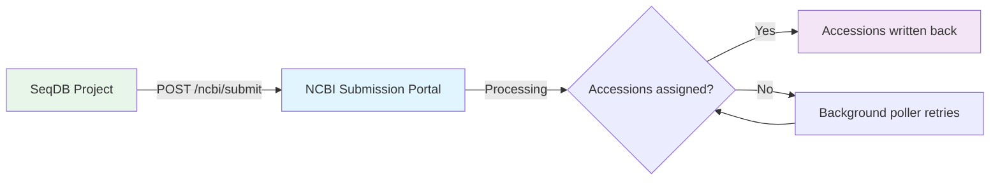
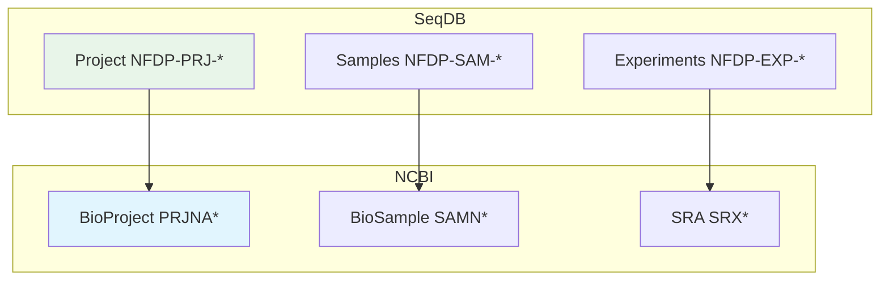
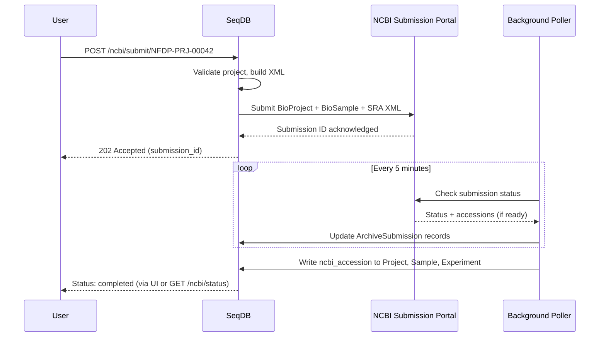

# NCBI Submission

This guide covers end-to-end submission of SeqDB projects to NCBI archives (BioProject, BioSample, SRA) using the automated submission pipeline.

---

## Overview

SeqDB submits entire projects to NCBI in a single action. The system builds XML for BioProject, BioSample (batched), and SRA, posts them to the NCBI Submission Portal API, and polls for accession assignment in the background.



---

## Prerequisites

| Requirement                 | Details                                                    |
|-----------------------------|------------------------------------------------------------|
| **Registered project**      | At least one project with accession `NFDP-PRJ-*`          |
| **Samples attached**        | Project must have samples with complete metadata           |
| **Experiments and runs**    | Each sample needs at least one experiment with runs        |
| **Files uploaded**          | All runs must have associated files in MinIO               |
| **NCBI API key configured** | Set by an administrator in SeqDB settings                  |
| **Validation passed**       | No blocking checklist errors                               |

!!! warning "Empty projects"
    Submitting a project with no samples returns `400 Bad Request`.

---

## Configuration

An administrator must configure three settings before NCBI submission is available:

| Setting                  | Environment variable       | Description                                |
|--------------------------|----------------------------|--------------------------------------------|
| `ncbi_api_key`           | `SEQDB_NCBI_API_KEY`      | NCBI API key (from NCBI account settings)  |
| `ncbi_submitter_email`   | `SEQDB_NCBI_EMAIL`        | Contact email sent with every submission    |
| `ncbi_center_name`       | `SEQDB_NCBI_CENTER_NAME`  | Submitting centre name (e.g., `NFDP`)      |

!!! tip "Getting an NCBI API key"
    Log in to [NCBI](https://www.ncbi.nlm.nih.gov/) > **My NCBI** > **API Key Management** > **Create an API Key**. Enter the key in **Admin** > **Settings** > **NCBI Configuration**.

!!! note "Rate limits"
    Without an API key, NCBI limits requests to 3/second. With a key, this increases to 10/second. The background poller respects these limits automatically.

---

## What Gets Submitted

SeqDB builds three XML documents per submission:

| XML document         | Source entity | NCBI archive   |
|----------------------|---------------|----------------|
| BioProject XML       | Project       | BioProject     |
| BioSample XML (batch)| All samples  | BioSample      |
| SRA XML              | Experiments + Runs | SRA       |



---

## Web UI Workflow

### Submitting a project

1. Navigate to the **Project detail page**.
2. Locate the **NCBI** card in the right sidebar.
3. Click **Submit to NCBI** and confirm.
4. The card shows a progress indicator with per-entity status.

### Admin dashboard

Navigate to **Admin** > **NCBI Submissions** for a global view:

| Section            | Description                                            |
|--------------------|--------------------------------------------------------|
| **Summary cards**  | Counts of pending, completed, and failed submissions   |
| **Submission table** | Full list with accession, date, status, and actions  |
| **Retry button**   | Re-submit individual failed entities                   |

---

## API Workflow

### Submit a project

```bash
curl -X POST \
     -H "Authorization: Bearer $TOKEN" \
     "https://seqdb.nfdp.org/api/v1/ncbi/submit/NFDP-PRJ-00042"
```

**Response** (`202 Accepted`):

```json
{
  "submission_id": "sub-ncbi-00187",
  "project_accession": "NFDP-PRJ-00042",
  "status": "submitted",
  "entities": { "project": "submitted", "samples": 45, "experiments": 45 },
  "created_at": "2026-03-15T10:30:00Z"
}
```

### Check status

```bash
curl -H "Authorization: Bearer $TOKEN" \
     "https://seqdb.nfdp.org/api/v1/ncbi/status/NFDP-PRJ-00042"
```

**Response** (`200 OK`):

```json
{
  "submission_id": "sub-ncbi-00187",
  "overall_status": "processing",
  "entities": {
    "project": { "status": "completed", "ncbi_accession": "PRJNA987654" },
    "samples": [
      { "accession": "NFDP-SAM-00301", "status": "completed", "ncbi_accession": "SAMN12345678" },
      { "accession": "NFDP-SAM-00302", "status": "processing", "ncbi_accession": null }
    ],
    "experiments": [
      { "accession": "NFDP-EXP-00401", "status": "completed", "ncbi_accession": "SRX19876543" }
    ]
  }
}
```

### Retry failed submissions

```bash
curl -X POST \
     -H "Authorization: Bearer $TOKEN" \
     "https://seqdb.nfdp.org/api/v1/ncbi/retry/sub-ncbi-00187"
```

**Response** (`202 Accepted`):

```json
{
  "submission_id": "sub-ncbi-00187",
  "status": "submitted",
  "retried_entities": 3,
  "message": "Retrying 3 failed entities"
}
```

---

## Submission Lifecycle



### Status states

| State          | Description                                               |
|----------------|-----------------------------------------------------------|
| `draft`        | Submission created but not yet sent                       |
| `submitted`    | XML posted to NCBI, awaiting processing                   |
| `processing`   | NCBI is validating the submission                         |
| `completed`    | All accessions assigned and written back                  |
| `failed`       | One or more entities failed NCBI validation               |

---

## Accession Mapping

Once NCBI processing completes, accessions are written to SeqDB entities:

| SeqDB entity | SeqDB accession | NCBI accession | Field            |
|--------------|-----------------|----------------|------------------|
| Project      | `NFDP-PRJ-*`   | `PRJNA*`       | `ncbi_accession` |
| Sample       | `NFDP-SAM-*`   | `SAMN*`        | `ncbi_accession` |
| Experiment   | `NFDP-EXP-*`   | `SRX*`         | `ncbi_accession` |
| Run          | `NFDP-RUN-*`   | `SRR*`         | `ncbi_accession` |

---

## ArchiveSubmission Records

Every submission creates `ArchiveSubmission` records (`archive="NCBI"`) tracking submission ID, entity type, status, NCBI accession, timestamps, and error messages.

!!! note "Source of truth"
    `ArchiveSubmission` records are the authoritative source for submission state. The background poller updates them, and both the UI and API read from them.

---

## CLI Usage

There is no dedicated `seqdb ncbi` CLI command yet. Use the API directly:

```bash
# Submit
curl -X POST -H "Authorization: Bearer $TOKEN" \
     "https://seqdb.nfdp.org/api/v1/ncbi/submit/NFDP-PRJ-00042"

# Poll status
watch -n 30 'curl -s -H "Authorization: Bearer $TOKEN" \
     "https://seqdb.nfdp.org/api/v1/ncbi/status/NFDP-PRJ-00042" | jq .overall_status'

# Retry failures
curl -X POST -H "Authorization: Bearer $TOKEN" \
     "https://seqdb.nfdp.org/api/v1/ncbi/retry/sub-ncbi-00187"
```

!!! tip "Using jq for monitoring"
    ```bash
    # Count completed samples
    curl -s -H "Authorization: Bearer $TOKEN" \
         "https://seqdb.nfdp.org/api/v1/ncbi/status/NFDP-PRJ-00042" \
         | jq '[.entities.samples[] | select(.status == "completed")] | length'
    ```

---

## Common Issues

!!! warning "Missing API key"
    `HTTP 400: NCBI API key not configured.` Fix: **Admin** > **Settings** > **NCBI Configuration** and enter a valid key.

!!! warning "Empty project"
    `HTTP 400: Project has no samples.` Register at least one sample before submitting.

!!! warning "NCBI validation failure"
    Correct metadata on flagged entities, then retry via `POST /ncbi/retry/{submission_id}` or the Admin dashboard Retry button.

!!! warning "Rate limit exceeded"
    `HTTP 429: NCBI rate limit exceeded.` The poller handles this automatically. Ensure `ncbi_api_key` is set for the higher 10 req/s limit.

!!! warning "Duplicate submission"
    Submitting a project with an active submission returns `409 Conflict`. Check existing status first; use retry for failures.

---

## Further Reading

- [ENA Submission Guide](ena-submission.md) -- Alternative archive via ENA
- [SNP Chip Genotyping](snpchip.md) -- Genotyping data workflow
- [API Overview](../api/overview.md) -- Full API reference
