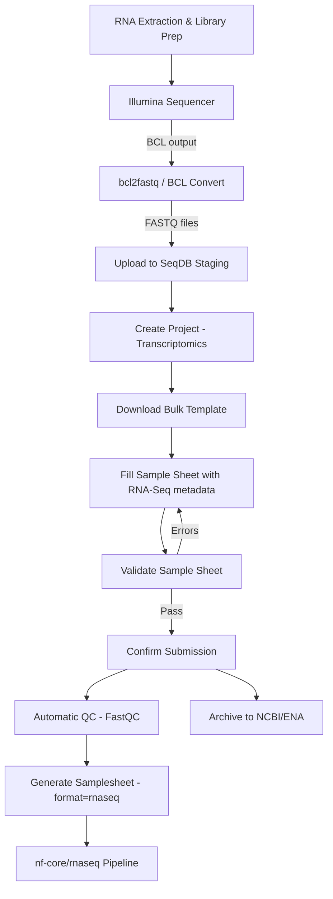

# RNA Sequencing (RNA-Seq)

This guide covers the complete workflow for submitting transcriptomics data to SeqDB, from raw FASTQ files through to generating samplesheets for the nf-core/rnaseq pipeline.

---

## Quick Reference

| Property           | Value                                          |
|--------------------|-------------------------------------------------|
| **Platform**       | `ILLUMINA` (NovaSeq 6000, NextSeq 2000)        |
| **Library Strategy** | `RNA-Seq`                                     |
| **Library Source**  | `TRANSCRIPTOMIC`                               |
| **File Type**      | `FASTQ` (paired-end or single-end)              |
| **Checklist**      | `ERC000011` (default)                           |
| **Pipeline Format** | `?format=rnaseq` (nf-core/rnaseq compatible)  |
| **Typical Scale**  | 3 -- 500 samples, 2 -- 20 GB per FASTQ file     |

---

## End-to-End Flow



---

## Step 1: Understand Your Data

RNA-Seq experiments produce FASTQ files from an Illumina sequencer. Key considerations:

| Layout         | Files per Sample | Description                        |
|----------------|------------------|------------------------------------|
| **Paired-end** | 2 (R1 + R2)     | Most common; better for isoform detection |
| **Single-end** | 1                | Lower cost; sufficient for gene-level quantification |

!!! tip "Library Layout"
    Set `library_layout` to `PAIRED` or `SINGLE` in your sample sheet. This determines how SeqDB generates pipeline samplesheets and how files are matched to runs.

### RNA-Seq-Specific Metadata

Beyond standard genomic metadata, transcriptomics experiments benefit from capturing:

- **Tissue type** -- Which tissue or cell type was profiled
- **Developmental stage** -- Embryonic, juvenile, adult, etc.
- **Treatment conditions** -- Control vs. treated, drug names, dosages
- **Strandedness** -- `unstranded`, `forward`, or `reverse` (critical for quantification)

These are recorded in the `custom_fields` of each sample.

---

## Step 2: Create a Project

### Web UI

1. Navigate to **Projects** > **New Project**
2. Set **Project Type** to `Transcriptomics`
3. Fill in the title and description
4. Click **Create**

### CLI

```bash
seqdb login
seqdb submit --project \
  --title "Liver Transcriptome Profiling 2026" \
  --description "RNA-Seq of liver tissue across 4 treatment groups" \
  --project-type Transcriptomics
```

### API

```bash
curl -X POST https://api.seqdb.nfdp.dev/api/v1/projects/ \
  -H "Authorization: Bearer $TOKEN" \
  -H "Content-Type: application/json" \
  -d '{
    "title": "Liver Transcriptome Profiling 2026",
    "description": "RNA-Seq of liver tissue across 4 treatment groups",
    "project_type": "Transcriptomics"
  }'
```

---

## Step 3: Upload Files to Staging

### CLI (recommended)

```bash
seqdb upload --project NFDP-PRJ-000050 \
  --files /data/rnaseq/*.fastq.gz \
  --threads 4
```

### API

```bash
curl -X POST https://api.seqdb.nfdp.dev/api/v1/staging/upload \
  -H "Authorization: Bearer $TOKEN" \
  -F "file=@LIVER_CTRL_01_R1.fastq.gz"
```

### Browser

Drag and drop files via **Staging** > **Upload Files** in the Web UI.

!!! note "Single-End Data"
    For single-end libraries, you only need one FASTQ file per sample. Leave the `filename_reverse` column empty in the sample sheet.

---

## Step 4: Prepare the Bulk Sample Sheet

### Download the Template

```bash
# CLI
seqdb template --checklist ERC000011 --output rnaseq_samples.tsv

# API
curl -O 'https://api.seqdb.nfdp.dev/api/v1/bulk-submit/template/ERC000011'
```

### Required Columns

| Column               | Example                        | Required | Notes                         |
|----------------------|--------------------------------|----------|-------------------------------|
| `sample_alias`       | `LIVER_CTRL_01`                | Yes      | Unique per sample             |
| `organism`           | `Bos taurus`                   | Yes      |                               |
| `tax_id`             | `9913`                         | Yes      |                               |
| `collection_date`    | `2026-02-10`                   | Yes      |                               |
| `geographic_location`| `Saudi Arabia:Jeddah`          | Yes      |                               |
| `filename_forward`   | `LIVER_CTRL_01_R1.fastq.gz`   | Yes      |                               |
| `filename_reverse`   | `LIVER_CTRL_01_R2.fastq.gz`   | PE only  | Leave blank for single-end    |
| `library_strategy`   | `RNA-Seq`                      | Yes      |                               |
| `library_source`     | `TRANSCRIPTOMIC`               | Yes      |                               |
| `library_layout`     | `PAIRED`                       | Yes      | `PAIRED` or `SINGLE`          |
| `platform`           | `ILLUMINA`                     | Yes      |                               |
| `instrument_model`   | `Illumina NovaSeq 6000`       | Yes      |                               |

### Custom Fields for RNA-Seq

Add experiment-specific metadata using the `custom_fields` column (JSON format):

```
{"tissue": "liver", "developmental_stage": "adult", "treatment": "control", "strandedness": "reverse"}
```

!!! warning "Strandedness"
    The `strandedness` field is critical for accurate gene quantification. Most modern Illumina kits (e.g., TruSeq Stranded mRNA) produce `reverse`-stranded libraries. If you are unsure, check your library prep kit documentation or use tools like `infer_experiment.py` from RSeQC.

### Example: Paired-End Sample Sheet

```tsv
sample_alias	organism	tax_id	collection_date	geographic_location	filename_forward	filename_reverse	library_strategy	library_source	library_layout	platform	instrument_model	custom_fields
LIVER_CTRL_01	Bos taurus	9913	2026-02-10	Saudi Arabia:Jeddah	LIVER_CTRL_01_R1.fastq.gz	LIVER_CTRL_01_R2.fastq.gz	RNA-Seq	TRANSCRIPTOMIC	PAIRED	ILLUMINA	Illumina NovaSeq 6000	{"tissue":"liver","treatment":"control","strandedness":"reverse"}
LIVER_CTRL_02	Bos taurus	9913	2026-02-10	Saudi Arabia:Jeddah	LIVER_CTRL_02_R1.fastq.gz	LIVER_CTRL_02_R2.fastq.gz	RNA-Seq	TRANSCRIPTOMIC	PAIRED	ILLUMINA	Illumina NovaSeq 6000	{"tissue":"liver","treatment":"control","strandedness":"reverse"}
LIVER_TREAT_01	Bos taurus	9913	2026-02-12	Saudi Arabia:Jeddah	LIVER_TREAT_01_R1.fastq.gz	LIVER_TREAT_01_R2.fastq.gz	RNA-Seq	TRANSCRIPTOMIC	PAIRED	ILLUMINA	Illumina NovaSeq 6000	{"tissue":"liver","treatment":"drug_A_10mg","strandedness":"reverse"}
```

### Example: Single-End Sample Sheet

```tsv
sample_alias	organism	tax_id	collection_date	geographic_location	filename_forward	filename_reverse	library_strategy	library_source	library_layout	platform	instrument_model	custom_fields
LIVER_SE_01	Bos taurus	9913	2026-02-10	Saudi Arabia:Jeddah	LIVER_SE_01.fastq.gz		RNA-Seq	TRANSCRIPTOMIC	SINGLE	ILLUMINA	NextSeq 2000	{"tissue":"liver","treatment":"control","strandedness":"reverse"}
```

---

## Step 5: Validate

### CLI

```bash
seqdb validate --file rnaseq_samples.tsv --checklist ERC000011
```

### API

```bash
curl -X POST https://api.seqdb.nfdp.dev/api/v1/bulk-submit/validate \
  -H "Authorization: Bearer $TOKEN" \
  -F "file=@rnaseq_samples.tsv" \
  -F "checklist_id=ERC000011"
```

Validation checks include:

- All required columns present and non-empty
- Filenames match files in the staging area
- `library_layout` is consistent with file columns (PAIRED requires both forward and reverse)
- Taxonomy IDs resolve against the NCBI taxonomy database

---

## Step 6: Confirm Submission

### CLI

```bash
seqdb submit --file rnaseq_samples.tsv \
  --project NFDP-PRJ-000050 \
  --checklist ERC000011
```

### API

```bash
curl -X POST https://api.seqdb.nfdp.dev/api/v1/bulk-submit/confirm \
  -H "Authorization: Bearer $TOKEN" \
  -F "file=@rnaseq_samples.tsv" \
  -F "project_accession=NFDP-PRJ-000050" \
  -F "checklist_id=ERC000011"
```

Response:

```json
{
  "status": "created",
  "samples": ["NFDP-SAM-000200", "NFDP-SAM-000201", "NFDP-SAM-000202"],
  "experiments": ["NFDP-EXP-000200", "NFDP-EXP-000201", "NFDP-EXP-000202"],
  "runs": ["NFDP-RUN-000400", "NFDP-RUN-000401", "NFDP-RUN-000402", "NFDP-RUN-000403", "NFDP-RUN-000404", "NFDP-RUN-000405"]
}
```

---

## Step 7: Quality Control

SeqDB runs FastQC automatically on all uploaded FASTQ files. For RNA-Seq data, pay particular attention to:

- **Per-base quality** -- Should be consistently high (>Q30)
- **Adapter content** -- Residual TruSeq adapters should be minimal
- **Duplication levels** -- Higher duplication is expected in RNA-Seq compared to WGS due to highly expressed genes
- **GC content** -- Bimodal distributions may indicate rRNA contamination

```bash
# Check QC status for a run
curl 'https://api.seqdb.nfdp.dev/api/v1/runs/NFDP-RUN-000400/qc'
```

!!! note "Expected Differences from WGS QC"
    RNA-Seq data typically shows higher duplication levels and more variable GC content than WGS. These are normal characteristics of transcriptomic data and should not be treated as failures.

---

## Step 8: Generate Pipeline Samplesheet

The `?format=rnaseq` samplesheet is formatted for direct use with [nf-core/rnaseq](https://nf-co.re/rnaseq). It includes the `strandedness` column extracted from `custom_fields`.

### CLI

```bash
seqdb fetch --project NFDP-PRJ-000050 --format rnaseq --output samplesheet.csv
```

### API

```bash
curl 'https://api.seqdb.nfdp.dev/api/v1/samplesheet/NFDP-PRJ-000050?format=rnaseq' \
  -o samplesheet.csv
```

### Output Format

The generated samplesheet looks like this:

```csv
sample,fastq_1,fastq_2,strandedness
LIVER_CTRL_01,/data/LIVER_CTRL_01_R1.fastq.gz,/data/LIVER_CTRL_01_R2.fastq.gz,reverse
LIVER_CTRL_02,/data/LIVER_CTRL_02_R1.fastq.gz,/data/LIVER_CTRL_02_R2.fastq.gz,reverse
LIVER_TREAT_01,/data/LIVER_TREAT_01_R1.fastq.gz,/data/LIVER_TREAT_01_R2.fastq.gz,reverse
```

### Run the Pipeline

```bash
nextflow run nf-core/rnaseq \
  --input samplesheet.csv \
  --genome GRCh38 \
  --aligner star_salmon \
  -profile singularity
```

!!! tip "Alternative Samplesheet Formats"
    Use `?format=fetchngs` for a generic format compatible with other tools, or `?format=generic` for a plain tabular download.

---

## Step 9: Archive to NCBI/ENA

### Submit

```bash
curl -X POST https://api.seqdb.nfdp.dev/api/v1/ncbi/submit/NFDP-PRJ-000050 \
  -H "Authorization: Bearer $TOKEN"
```

### Check Status

```bash
curl 'https://api.seqdb.nfdp.dev/api/v1/ncbi/status/NFDP-PRJ-000050' \
  -H "Authorization: Bearer $TOKEN"
```

---

## Complete CLI Workflow

```bash
# 1. Authenticate
seqdb login

# 2. Download template
seqdb template --checklist ERC000011 --output rnaseq_samples.tsv

# 3. Edit the template with RNA-Seq metadata
# ... fill in sample metadata, set library_strategy=RNA-Seq ...

# 4. Upload FASTQ files
seqdb upload --project NFDP-PRJ-000050 \
  --files /data/rnaseq/*.fastq.gz \
  --threads 4

# 5. Validate
seqdb validate --file rnaseq_samples.tsv --checklist ERC000011

# 6. Submit
seqdb submit --file rnaseq_samples.tsv \
  --project NFDP-PRJ-000050 \
  --checklist ERC000011

# 7. Check status and QC
seqdb status --project NFDP-PRJ-000050

# 8. Generate nf-core/rnaseq samplesheet
seqdb fetch --project NFDP-PRJ-000050 --format rnaseq --output samplesheet.csv

# 9. Run analysis
nextflow run nf-core/rnaseq --input samplesheet.csv --genome GRCh38
```

---

## Troubleshooting

| Issue | Cause | Fix |
|-------|-------|-----|
| `library_layout mismatch` | `PAIRED` set but `filename_reverse` is empty | Set layout to `SINGLE` or provide the reverse file |
| High rRNA in QC | Incomplete rRNA depletion | Consider re-prepping libraries with better rRNA removal |
| Wrong strandedness in results | Incorrect value in `custom_fields` | Run `infer_experiment.py` on a subset, update metadata |
| Low mapping rate | Wrong reference genome | Verify organism and genome build match |
| `file_not_found` during validation | FASTQ not in staging | Upload missing files before re-validating |
