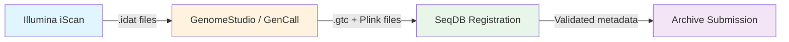
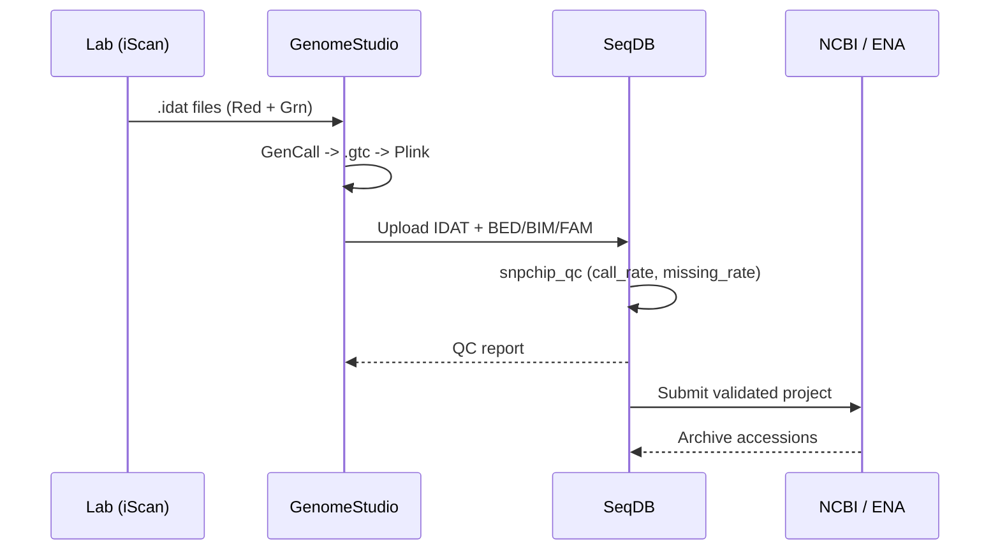

# SNP Chip Genotyping (Illumina iScan)

This guide covers the complete workflow for submitting SNP chip genotyping data to SeqDB, from Illumina iScan output through to archive-ready metadata.

---

## Quick Reference

| Field               | Value                                      |
|---------------------|--------------------------------------------|
| **Project type**    | Genotyping                                 |
| **Platform**        | `SNP_CHIP`                                 |
| **Library strategy**| `GENOTYPING`                               |
| **Library layout**  | `SINGLE`                                   |
| **Checklist**       | `snpchip_livestock`                        |
| **File types**      | IDAT, BED_BIM_FAM, PED_MAP, VCF           |
| **Storage bucket**  | `nfdp-snpchip`                             |
| **Typical scale**   | 100 -- 10,000 samples per study            |
| **QC threshold**    | Call rate >= 95%, missing rate <= 5%        |
| **Samplesheet**     | `?format=snpchip`                          |

---

## Workflow Overview



1. **Lab processing** -- Illumina iScan scans BeadChip arrays, producing paired `.idat` files (Red + Green channel) per sample.
2. **Genotype calling** -- GenomeStudio or GenCall converts raw intensity into `.gtc` files and Plink-format genotype files.
3. **Upload to SeqDB** -- Register a Genotyping project, upload sample metadata via `snpchip_livestock`, attach files.
4. **Automated QC** -- SeqDB runs `snpchip_qc` checks on call rate and missing rate.
5. **Archive** -- Submit to NCBI or export ENA XML from the validated project.

---

## Lab Output: Understanding the Files

The iScan produces two `.idat` files per sample (`*_Red.idat` and `*_Grn.idat`).

!!! note "IDAT naming convention"
    Files follow the pattern `{SentrixBarcode}_{SentrixPosition}_{Red|Grn}.idat`. Preserve original filenames so downstream tools can pair them correctly.

After GenomeStudio/GenCall processing:

| Format           | Files                    | Description                              |
|------------------|--------------------------|------------------------------------------|
| **Plink binary** | `.bed`, `.bim`, `.fam`  | Compact binary genotype + map + pedigree |
| **Plink text**   | `.ped`, `.map`          | Text-based genotype + map                |
| **VCF**          | `.vcf` or `.vcf.gz`    | Variant Call Format                      |

!!! tip "Preferred format"
    Upload **BED/BIM/FAM** (Plink binary) as the primary genotype file. It is compact, widely supported, and loads quickly in PLINK 2 and GCTA.

---

## Checklist: `snpchip_livestock`

The `snpchip_livestock` checklist requires 18+ fields:

| Field                  | Required | Example              | Category          |
|------------------------|----------|----------------------|-------------------|
| `sample_alias`         | Yes      | `FARM-A-COW-0042`   | Sample identity   |
| `organism`             | Yes      | `Bos taurus`        | Sample identity   |
| `breed`                | Yes      | `Holstein`           | Sample identity   |
| `sex`                  | No       | `female`             | Sample identity   |
| `chip_type`            | Yes      | `BovineSNP50`        | Chip/genotyping   |
| `chip_manufacturer`    | Yes      | `Illumina`           | Chip/genotyping   |
| `chip_density`         | Yes      | `50K`                | Chip/genotyping   |
| `total_snps_on_chip`   | Yes      | `54609`              | Chip/genotyping   |
| `snps_called`          | Yes      | `52871`              | Chip/genotyping   |
| `call_rate`            | Yes      | `0.9682`             | Chip/genotyping   |
| `call_rate_threshold`  | Yes      | `0.95`               | Chip/genotyping   |
| `genotyping_software`  | Yes      | `GenomeStudio`       | Software/ref      |
| `software_version`     | Yes      | `2.0.5`              | Software/ref      |
| `reference_genome`     | Yes      | `ARS-UCD1.2`         | Software/ref      |
| `purpose`              | Yes      | `GWAS`               | Purpose           |

**Purpose values**: `GWAS`, `parentage`, `genomic_selection`, `breed_characterization`

!!! warning "Call rate validation"
    Samples with `call_rate` below the `call_rate_threshold` (default 0.95) will be flagged during QC. You can still submit them, but they will carry a QC warning.

---

## QC: Automatic `snpchip_qc`

| Check             | Pass criteria           | Action on failure          |
|-------------------|-------------------------|----------------------------|
| Call rate          | >= 95%                 | QC warning on sample       |
| Missing rate       | <= 5%                  | QC warning on sample       |
| Chip density match | Matches `chip_type`    | Validation error           |
| File pairing       | Red + Grn IDAT present | Validation error           |

!!! note "QC is non-blocking"
    QC warnings do not prevent submission. Validation errors (chip density mismatch, unpaired IDAT) must be resolved before archiving.

---

## Bulk Submission (Large Studies)

### 1. Download the template

=== "CLI"

    ```bash
    seqdb template download --checklist snpchip_livestock -o snpchip_template.tsv
    ```

=== "API"

    ```bash
    curl -H "Authorization: Bearer $TOKEN" \
         "https://seqdb.nfdp.org/api/v1/checklists/snpchip_livestock/template" \
         -o snpchip_template.tsv
    ```

### 2. Fill the template

```
sample_alias    organism    breed    chip_type    call_rate    ...
FARM-A-001      Bos taurus  Holstein BovineSNP50  0.9712       ...
FARM-A-002      Bos taurus  Holstein BovineSNP50  0.9685       ...
FARM-A-1000     Bos taurus  Angus    BovineSNP50  0.9801       ...
```

!!! tip "Spreadsheet tips"
    Use **TSV** (not CSV). Do not modify headers. Validate `call_rate` is between 0 and 1 (not a percentage).

### 3. Upload

=== "CLI"

    ```bash
    seqdb samples bulk-upload \
        --project NFDP-PRJ-00042 \
        --checklist snpchip_livestock \
        --file snpchip_template.tsv
    ```

=== "API"

    ```bash
    curl -X POST \
         -H "Authorization: Bearer $TOKEN" \
         -H "Content-Type: text/tab-separated-values" \
         --data-binary @snpchip_template.tsv \
         "https://seqdb.nfdp.org/api/v1/samples/bulk?project=NFDP-PRJ-00042&checklist=snpchip_livestock"
    ```

---

## Samplesheet Export

```bash
curl -H "Authorization: Bearer $TOKEN" \
     "https://seqdb.nfdp.org/api/v1/samplesheet/NFDP-PRJ-00042?format=snpchip"
```

Output columns for `format=snpchip`:

| Column          | Description                               |
|-----------------|-------------------------------------------|
| `sample`        | Sample accession (`NFDP-SAM-*`)           |
| `organism`      | Scientific name                           |
| `breed`         | Breed name                                |
| `idat_red`      | Presigned URL to Red channel IDAT         |
| `idat_grn`      | Presigned URL to Green channel IDAT       |
| `genotype_file` | Presigned URL to BED/BIM/FAM or VCF file  |

---

## File Upload and Storage

All SNP chip files are stored in the `nfdp-snpchip` MinIO bucket.

=== "CLI"

    ```bash
    # Upload IDAT pair
    seqdb files upload --experiment NFDP-EXP-00099 --type IDAT \
        204126380048_R01C01_Red.idat 204126380048_R01C01_Grn.idat

    # Upload Plink binary set
    seqdb files upload --experiment NFDP-EXP-00099 --type BED_BIM_FAM \
        study_qc.bed study_qc.bim study_qc.fam
    ```

=== "API"

    ```bash
    # Get presigned upload URL
    curl -X POST -H "Authorization: Bearer $TOKEN" \
         -H "Content-Type: application/json" \
         -d '{"filename": "204126380048_R01C01_Red.idat", "file_type": "IDAT"}' \
         "https://seqdb.nfdp.org/api/v1/experiments/NFDP-EXP-00099/files/upload-url"

    # Upload to the returned presigned URL
    curl -X PUT -T 204126380048_R01C01_Red.idat "<presigned_url>"
    ```

---

## Registering a Project and Experiments

```bash
# Create project
seqdb project create \
    --title "Dairy cattle 50K genotyping 2026" \
    --type Genotyping \
    --organism "Bos taurus" \
    --description "Genomic selection panel, Holstein + Angus, 2000 head"

# Add experiment per sample
seqdb experiment create \
    --sample NFDP-SAM-00301 \
    --platform SNP_CHIP \
    --library-strategy GENOTYPING \
    --library-layout SINGLE \
    --instrument "Illumina iScan"
```

---

## End-to-End Example



```bash
# Complete CLI walkthrough
seqdb project create --title "Sheep 50K parentage 2026" --type Genotyping --organism "Ovis aries"
seqdb samples bulk-upload --project NFDP-PRJ-00055 --checklist snpchip_livestock --file sheep_samples.tsv
seqdb experiment bulk-create --project NFDP-PRJ-00055 --platform SNP_CHIP --library-strategy GENOTYPING --library-layout SINGLE
seqdb files bulk-upload --project NFDP-PRJ-00055 --manifest file_manifest.tsv
seqdb project qc NFDP-PRJ-00055
seqdb samplesheet NFDP-PRJ-00055 --format snpchip -o samplesheet.csv
```

---

## Common Issues

!!! warning "Unpaired IDAT files"
    Every sample must have both `_Red.idat` and `_Grn.idat`. The SentrixBarcode and SentrixPosition must match exactly.

!!! warning "Call rate as percentage"
    The `call_rate` field expects a decimal between 0 and 1 (e.g., `0.9682`), not a percentage. Values greater than 1 cause a validation error.

!!! tip "Large studies and timeouts"
    For studies exceeding 5,000 samples, bulk upload returns `202 Accepted` with a task ID. Poll the task status endpoint until completion.

!!! note "Chip density values"
    Use standardised labels: `7K`, `15K`, `50K`, `150K`, `600K`, `850K`. Custom values trigger an informational note.

---

## Further Reading

- [NCBI Submission Guide](ncbi-submission.md) -- Submit genotyping projects to NCBI
- [ENA Submission Guide](ena-submission.md) -- Export XML for ENA
- [API Overview](../api/overview.md) -- Programmatic access reference
