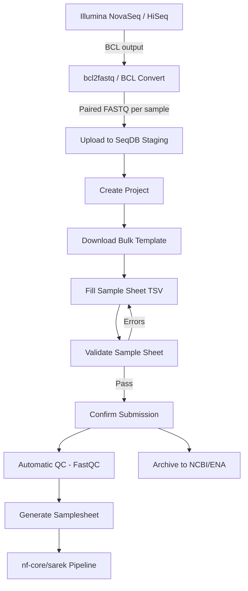

# Whole Genome Sequencing (WGS)

This guide walks through the complete end-to-end workflow for submitting whole genome sequencing data to SeqDB, from raw FASTQ files off the sequencer to archived data ready for downstream analysis.

---

## Quick Reference

| Property           | Value                                      |
|--------------------|--------------------------------------------|
| **Platform**       | `ILLUMINA` (NovaSeq 6000, HiSeq X Ten)    |
| **Library Strategy** | `WGS`                                    |
| **Library Source**  | `GENOMIC`                                 |
| **File Type**      | `FASTQ` (paired-end: R1 + R2 per sample)  |
| **Checklist**      | `ERC000011` (default) or `ERC000055` (farm animal) |
| **Pipeline Format** | `?format=sarek` (variant calling) or `?format=fetchngs` (generic) |
| **Typical Scale**  | 10 -- 1,000 samples, 1 -- 50 GB per FASTQ file |

---

## End-to-End Flow



---

## Step 1: Prepare Your Files

WGS data from Illumina sequencers is produced as BCL files, which are converted to FASTQ using `bcl2fastq` or Illumina's BCL Convert:

```bash
# Convert BCL to FASTQ (standard Illumina demultiplexing)
bcl2fastq \
  --runfolder-dir /data/sequencer/231115_A00001_0100_AHXXXXXX \
  --output-dir /data/fastq/ \
  --sample-sheet SampleSheet.csv
```

This produces paired-end files per sample:

```
SAMPLE_001_S1_L001_R1_001.fastq.gz   # Forward reads
SAMPLE_001_S1_L001_R2_001.fastq.gz   # Reverse reads
```

!!! tip "File Naming"
    SeqDB matches files by filename. Rename files to something descriptive before uploading (e.g., `CAMEL_01_R1.fastq.gz`). Avoid special characters and spaces.

---

## Step 2: Create a Project

### Web UI

1. Navigate to **Projects** > **New Project**
2. Set **Project Type** to `WGS`
3. Fill in the title, description, and organism
4. Click **Create**

### CLI

```bash
seqdb login
seqdb submit --project \
  --title "Arabian Camel WGS 2026" \
  --description "Whole genome sequencing of 200 Arabian camels" \
  --project-type WGS
```

### API

```bash
curl -X POST https://api.seqdb.nfdp.dev/api/v1/projects/ \
  -H "Authorization: Bearer $TOKEN" \
  -H "Content-Type: application/json" \
  -d '{
    "title": "Arabian Camel WGS 2026",
    "description": "Whole genome sequencing of 200 Arabian camels",
    "project_type": "WGS"
  }'
```

The response includes your project accession (e.g., `NFDP-PRJ-000042`). Save this for subsequent steps.

---

## Step 3: Choose a Checklist

Select the appropriate metadata checklist for your samples:

| Checklist     | Use Case                              |
|---------------|---------------------------------------|
| `ERC000011`   | Default -- works for any organism     |
| `ERC000055`   | Farm/livestock animals (adds breed, sex, etc.) |
| `ERC000020`   | Pathogen samples                      |

!!! note "Livestock Projects"
    For livestock WGS, use `ERC000055`. It includes breed-specific fields (`breed`, `sex`, `specimen_voucher`) that are required for proper archival in NCBI/ENA.

---

## Step 4: Upload Files to Staging

Files must be uploaded to the staging area before they can be linked to samples.

### Browser Upload (< 5 GB per file)

1. Go to **Staging** > **Upload Files**
2. Drag and drop your FASTQ files
3. Wait for upload and checksum verification

### CLI Upload (recommended for large datasets)

```bash
# Upload all FASTQ files in a directory with 4 parallel threads
seqdb upload --project NFDP-PRJ-000042 \
  --files /data/fastq/*.fastq.gz \
  --threads 4
```

### API Upload

```bash
curl -X POST https://api.seqdb.nfdp.dev/api/v1/staging/upload \
  -H "Authorization: Bearer $TOKEN" \
  -F "file=@CAMEL_01_R1.fastq.gz"
```

!!! warning "Large Files"
    For files larger than 5 GB, use the CLI or FTP upload. Browser uploads may time out for very large files. The CLI handles chunked uploads and automatic retry.

---

## Step 5: Prepare the Bulk Sample Sheet

### Download the Template

```bash
# CLI
seqdb template --checklist ERC000055 --output wgs_samples.tsv

# API
curl -O 'https://api.seqdb.nfdp.dev/api/v1/bulk-submit/template/ERC000055'
```

### Fill the Template

The TSV sample sheet requires these columns for WGS:

| Column              | Example                     | Required |
|---------------------|-----------------------------|----------|
| `sample_alias`      | `CAMEL_01`                  | Yes      |
| `organism`          | `Camelus dromedarius`       | Yes      |
| `tax_id`            | `9838`                      | Yes      |
| `breed`             | `Arabian`                   | Checklist |
| `sex`               | `female`                    | Checklist |
| `collection_date`   | `2026-01-15`                | Yes      |
| `geographic_location` | `Saudi Arabia:Riyadh`     | Yes      |
| `filename_forward`  | `CAMEL_01_R1.fastq.gz`     | Yes      |
| `filename_reverse`  | `CAMEL_01_R2.fastq.gz`     | Yes      |
| `library_strategy`  | `WGS`                       | Yes      |
| `library_source`    | `GENOMIC`                   | Yes      |
| `platform`          | `ILLUMINA`                  | Yes      |
| `instrument_model`  | `Illumina NovaSeq 6000`    | Yes      |

!!! tip "Spreadsheet Editing"
    You can edit the TSV in Excel or Google Sheets. Just make sure to export as tab-separated values (TSV), not CSV. Avoid adding extra columns or changing column headers.

---

## Step 6: Validate the Sample Sheet

### CLI

```bash
seqdb validate --file wgs_samples.tsv --checklist ERC000055
```

### API

```bash
curl -X POST https://api.seqdb.nfdp.dev/api/v1/bulk-submit/validate \
  -H "Authorization: Bearer $TOKEN" \
  -F "file=@wgs_samples.tsv" \
  -F "checklist_id=ERC000055"
```

The response highlights any errors at the cell level:

```json
{
  "valid": false,
  "errors": [
    {"row": 3, "column": "tax_id", "status": "missing_required", "message": "tax_id is required"},
    {"row": 5, "column": "filename_reverse", "status": "file_not_found", "message": "File not in staging"}
  ]
}
```

Fix the errors in your TSV and re-validate until all rows pass.

---

## Step 7: Confirm Submission

### CLI

```bash
seqdb submit --file wgs_samples.tsv \
  --project NFDP-PRJ-000042 \
  --checklist ERC000055
```

### API

```bash
curl -X POST https://api.seqdb.nfdp.dev/api/v1/bulk-submit/confirm \
  -H "Authorization: Bearer $TOKEN" \
  -F "file=@wgs_samples.tsv" \
  -F "project_accession=NFDP-PRJ-000042" \
  -F "checklist_id=ERC000055"
```

Response:

```json
{
  "status": "created",
  "samples": ["NFDP-SAM-000100", "NFDP-SAM-000101", "NFDP-SAM-000102"],
  "experiments": ["NFDP-EXP-000100", "NFDP-EXP-000101", "NFDP-EXP-000102"],
  "runs": ["NFDP-RUN-000200", "NFDP-RUN-000201", "NFDP-RUN-000202", "NFDP-RUN-000203", "NFDP-RUN-000204", "NFDP-RUN-000205"]
}
```

---

## Step 8: Quality Control

SeqDB automatically runs FastQC on every uploaded FASTQ file. QC metrics include:

- **Per-base sequence quality** -- Phred scores across read positions
- **Adapter content** -- Detection of residual adapter sequences
- **Duplication levels** -- PCR duplicate estimation
- **GC content** -- Distribution check for contamination
- **Sequence length distribution** -- Consistency of read lengths

### View QC Results

```bash
# CLI
seqdb status --project NFDP-PRJ-000042

# API
curl 'https://api.seqdb.nfdp.dev/api/v1/runs/NFDP-RUN-000200/qc'
```

!!! warning "QC Failures"
    High adapter content or low per-base quality may indicate a library preparation issue. SeqDB flags these but does not block submission. Review flagged runs before proceeding to analysis.

---

## Step 9: Generate Pipeline Samplesheets

SeqDB can generate samplesheets formatted for popular nf-core pipelines.

### Sarek (Variant Calling)

```bash
# CLI
seqdb fetch --project NFDP-PRJ-000042 --format sarek --output samplesheet.csv

# API
curl 'https://api.seqdb.nfdp.dev/api/v1/samplesheet/NFDP-PRJ-000042?format=sarek' \
  -o samplesheet.csv
```

Then run the pipeline:

```bash
nextflow run nf-core/sarek \
  --input samplesheet.csv \
  --genome GRCh38 \
  --tools haplotypecaller,vep \
  -profile singularity
```

### fetchngs (Generic)

```bash
curl 'https://api.seqdb.nfdp.dev/api/v1/samplesheet/NFDP-PRJ-000042?format=fetchngs' \
  -o samplesheet.csv
```

---

## Step 10: Archive to NCBI/ENA

Once data is finalized, submit to public archives for permanent accession numbers.

### Submit

```bash
# API
curl -X POST https://api.seqdb.nfdp.dev/api/v1/ncbi/submit/NFDP-PRJ-000042 \
  -H "Authorization: Bearer $TOKEN"
```

### Check Status

```bash
curl 'https://api.seqdb.nfdp.dev/api/v1/ncbi/status/NFDP-PRJ-000042' \
  -H "Authorization: Bearer $TOKEN"
```

Response:

```json
{
  "status": "submitted",
  "ncbi_bioproject": "PRJNA999999",
  "submitted_at": "2026-03-15T10:30:00Z",
  "message": "Submission accepted. BioSample accessions pending."
}
```

!!! note "Processing Time"
    NCBI typically processes submissions within 24-48 hours. ENA processing may take up to 5 business days. Check status periodically with the status endpoint.

---

## Complete CLI Workflow

For users who prefer the command line, here is the full workflow in one block:

```bash
# 1. Authenticate
seqdb login

# 2. Download template
seqdb template --checklist ERC000055 --output wgs_samples.tsv

# 3. Edit the template (use your preferred editor)
# ... fill in sample metadata ...

# 4. Upload files
seqdb upload --project NFDP-PRJ-000042 \
  --files /data/fastq/*.fastq.gz \
  --threads 4

# 5. Validate
seqdb validate --file wgs_samples.tsv --checklist ERC000055

# 6. Submit
seqdb submit --file wgs_samples.tsv \
  --project NFDP-PRJ-000042 \
  --checklist ERC000055

# 7. Check status
seqdb status --project NFDP-PRJ-000042

# 8. Generate pipeline samplesheet
seqdb fetch --project NFDP-PRJ-000042 --format sarek --output samplesheet.csv

# 9. Run analysis
nextflow run nf-core/sarek --input samplesheet.csv --genome GRCh38
```

---

## Troubleshooting

| Issue | Cause | Fix |
|-------|-------|-----|
| `file_not_found` during validation | FASTQ not uploaded to staging | Upload missing files with `seqdb upload` |
| `checksum_mismatch` | File corrupted during transfer | Re-upload the file; CLI auto-retries |
| `invalid_tax_id` | Taxonomy ID not in NCBI database | Look up correct ID at [NCBI Taxonomy](https://www.ncbi.nlm.nih.gov/taxonomy) |
| QC flag: high adapter content | Adapter trimming incomplete | Consider re-running bcl2fastq with `--adapter-stringency 0.9` |
| Submission rejected by NCBI | Missing required metadata | Check NCBI requirements and update sample metadata |
