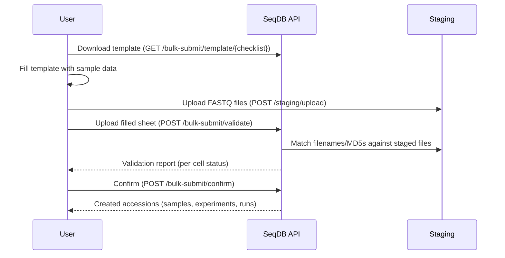

# Bulk Submission

Submit many samples at once using a TSV sample sheet — similar to ENA's Webin spreadsheet submission.

## Overview

Bulk submission lets you register dozens or hundreds of samples in one operation by uploading a tab-separated spreadsheet. The system validates metadata, matches files, and creates all entities atomically.

## Workflow



## Via the Web UI

### From the main Submit page

1. Go to **Submit** → **Bulk Submit**
2. Follow the 4-step wizard: Project → Upload → Sample Sheet → Confirm

### From a project page

1. Go to **Browse** → click a project
2. Click **Bulk Upload** in the Samples card
3. Select checklist, download template, fill and upload

## Via the API

### Step 1: Download template

```bash
curl -O 'http://localhost:8000/api/v1/bulk-submit/template/ERC000011'
```

This downloads a TSV file with:

- All checklist columns as headers
- 2 demo rows with realistic example data
- File matching columns (`filename_forward`, `filename_reverse`, `md5_forward`, `md5_reverse`)
- Sequencing columns (`platform`, `instrument_model`, `library_strategy`)

### Step 2: Upload files to staging

```bash
# Upload each FASTQ file
curl -X POST http://localhost:8000/api/v1/staging/upload \
  -H "Authorization: Bearer $TOKEN" \
  -F "file=@SAMPLE_001_R1.fastq.gz"

curl -X POST http://localhost:8000/api/v1/staging/upload \
  -H "Authorization: Bearer $TOKEN" \
  -F "file=@SAMPLE_001_R2.fastq.gz"
```

### Step 3: Validate

```bash
curl -X POST http://localhost:8000/api/v1/bulk-submit/validate \
  -H "Authorization: Bearer $TOKEN" \
  -F "file=@filled_template.tsv" \
  -F "checklist_id=ERC000011"
```

The response includes per-cell validation:

```json
{
  "valid": true,
  "total_rows": 2,
  "headers": ["sample_alias", "organism", "tax_id", ...],
  "required_fields": ["organism", "tax_id", "sample_alias"],
  "rows": [
    {
      "row_num": 2,
      "sample_alias": "SAMPLE_001",
      "cells": {
        "organism": {"value": "Camelus dromedarius", "status": "ok"},
        "tax_id": {"value": "9838", "status": "ok"},
        "collection_date": {"value": "", "status": "empty_optional"}
      },
      "forward_file": {"filename": "SAMPLE_001_R1.fastq.gz", "md5": "abc123..."},
      "reverse_file": {"filename": "SAMPLE_001_R2.fastq.gz", "md5": "def456..."},
      "errors": [],
      "warnings": []
    }
  ]
}
```

### Step 4: Confirm

```bash
curl -X POST http://localhost:8000/api/v1/bulk-submit/confirm \
  -H "Authorization: Bearer $TOKEN" \
  -F "file=@filled_template.tsv" \
  -F "project_accession=NFDP-PRJ-000001" \
  -F "checklist_id=ERC000011"
```

Response:
```json
{
  "status": "created",
  "samples": ["NFDP-SAM-000001", "NFDP-SAM-000002"],
  "experiments": ["NFDP-EXP-000001", "NFDP-EXP-000002"],
  "runs": ["NFDP-RUN-000001", "NFDP-RUN-000002", "NFDP-RUN-000003", "NFDP-RUN-000004"]
}
```

## Available checklists

| ID | Name | Required fields |
|----|------|----------------|
| `ERC000011` | ENA Default | organism, tax_id |
| `ERC000020` | Pathogen Clinical/Host | organism, tax_id, isolation_source, host |
| `ERC000043` | Virus Pathogen | organism, tax_id, strain, isolation_source |
| `ERC000055` | Farm Animal | organism, tax_id, breed |
| `snpchip_livestock` | SNP Chip Livestock | organism, tax_id, breed |

## File matching

The system uses a 3-tier strategy to match sample sheet rows to staged files:

1. **Exact filename match** — Looks for `filename_forward` in staged files
2. **MD5 match** — If filename not found, searches staged files by `md5_forward`
3. **Alias pattern** — Falls back to matching `{sample_alias}[._-]R1` in filenames

If none match, the system suggests the closest staged filename.

!!! warning "Filename typos"
    If your filenames have typos (e.g., `_R1.fast.gz` instead of `_R1.fastq.gz`), the system will try MD5 and alias matching before failing. The error message will suggest the closest match.

## Template columns

| Column | Required | Description |
|--------|----------|-------------|
| `sample_alias` | Yes | Unique sample identifier |
| `organism` | Yes* | Species name |
| `tax_id` | Yes* | NCBI taxonomy ID |
| `collection_date` | Depends | Date of sample collection (YYYY-MM-DD) |
| `geographic_location` | Depends | Where the sample was collected |
| `breed` | Depends | Animal breed |
| `host` | No | Host organism |
| `tissue` | No | Tissue type |
| `sex` | No | male / female / unknown |
| `filename_forward` | No | Forward read filename |
| `filename_reverse` | No | Reverse read filename |
| `md5_forward` | No | MD5 of forward file |
| `md5_reverse` | No | MD5 of reverse file |
| `platform` | No | ILLUMINA (default) |
| `instrument_model` | No | e.g., Illumina NovaSeq 6000 |
| `library_strategy` | No | WGS (default) |

*Required fields depend on the selected checklist.
