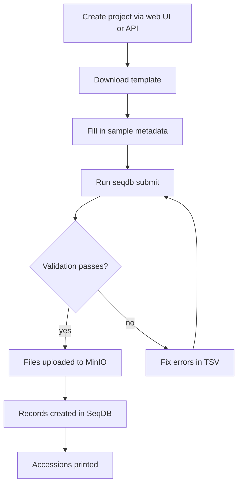
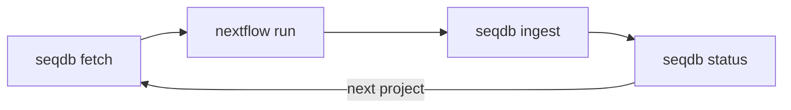

# CLI Submission Guide

This guide walks through submitting genomic data to SeqDB using the `seqdb`
command-line tool -- from authentication through submission, fetching, and QC
ingestion.

---

## Installation

```bash
pip install seqdb-cli
seqdb --version
```

!!! note "Python requirement"
    seqdb-cli requires Python 3.10+. Install in a virtual environment or via
    `pipx`.

---

## Authentication

```bash
seqdb login --url https://seqdb.nfdp.org --email you@nfdp.org
```

Credentials are stored in `~/.seqdb/config.toml`:

```toml
[auth]
url = "https://seqdb.nfdp.org"
email = "you@nfdp.org"
token = "eyJhbGciOi..."
refresh_token = "dGhpcyBpcyBh..."
expires_at = "2026-03-16T08:30:00Z"
```

!!! warning "Token storage"
    The config file contains your access token in plain text. Ensure
    `~/.seqdb/config.toml` has permissions `600`.

Tokens expire after 24 hours. The CLI refreshes them automatically using the
stored refresh token. If the refresh token also expires, run `seqdb login`
again. To remove credentials: `seqdb logout`.

---

## Submission Workflow Overview



---

## Step-by-Step Guide

### Step 1: Create a Project

Projects are created through the web UI or REST API -- the CLI does not create
projects yet. Note the returned accession (e.g. `NFDP-PRJ-000001`).

### Step 2: Download a Template

```bash
seqdb template ERC000011 -o samples.tsv
```

!!! tip "Finding the right checklist"
    Checklist IDs follow the ENA convention (e.g. `ERC000011` for default
    sample checklist). Check the web UI under **Checklists** for the full list.

### Step 3: Fill in the Template

Populate each row with sample metadata. Required fields at minimum:

- **sample_alias** -- unique name per sample
- **organism** -- scientific name (e.g. `Camelus dromedarius`)
- **tax_id** -- NCBI taxonomy ID (e.g. `9838`)

Additional columns depend on the checklist (breed, sex, tissue, etc.).

### Step 4: Submit

```bash
seqdb submit samples.tsv \
  --checklist ERC000011 \
  --project NFDP-PRJ-000001 \
  --files ./reads/ \
  --threads 8
```

| Flag           | Description                                      |
|----------------|--------------------------------------------------|
| `--checklist`  | Checklist ID to validate against                 |
| `--project`    | Target project accession                         |
| `--files`      | Directory or glob pattern for data files         |
| `--threads`    | Number of parallel upload threads (default: 4)   |
| `--yes`        | Skip confirmation prompt (for CI/CD)             |

#### What `submit` Does Internally

1. **Upload** -- Files are uploaded to MinIO in parallel with progress bars.
2. **Validate** -- TSV is checked against the checklist schema (column names,
   required fields, controlled vocabularies, file references).
3. **Confirm** -- Summary printed; user confirms (unless `--yes`).
4. **Create records** -- Sample, experiment, and run records created; accessions
   printed to stdout.

```
Uploading 2048 files with 8 threads...
  [========================================] 2048/2048 100%

Validating samples.tsv against ERC000011...
  1000 samples validated. 0 errors, 2 warnings.

Summary:
  Project: NFDP-PRJ-000001 | Samples: 1000 | Runs: 1000 | Files: 2048

Proceed? [y/N] y

Created: NFDP-SAM-000001..NFDP-SAM-001000
```

---

## Individual Commands

### Validate Only

```bash
seqdb validate samples.tsv --checklist ERC000011
```

```
ERROR: row 15 - 'organism' is required but empty
ERROR: row 42 - 'sex' value 'M' not in controlled vocabulary (male, female, unknown)
2 errors. Validation FAILED.
```

!!! tip "Validate before submit"
    Running `seqdb validate` first saves time -- no need to wait for file
    uploads to discover metadata problems.

### Upload Only

Stage files to MinIO without creating metadata records:

```bash
seqdb upload reads/*.fastq.gz --threads 8
```

Useful when files are very large and you want to decouple the transfer from the
metadata submission.

---

## Fetching Data

```bash
# Generate samplesheet for nf-core/sarek
seqdb fetch NFDP-PRJ-000001 --format sarek -o ./data/samplesheet.csv

# Download all FASTQ files for a project
seqdb fetch NFDP-PRJ-000001 --format fetchngs -o ./data/

# Print download URLs without fetching
seqdb fetch NFDP-PRJ-000001 --format generic --urls-only
```

!!! warning "Presigned URL expiry"
    Download URLs are valid for **24 hours**. Regenerate the samplesheet if
    you run the pipeline later.

---

## Ingesting QC Results

After running a pipeline, ingest MultiQC results back into SeqDB:

```bash
seqdb ingest NFDP-PRJ-000001 --multiqc ./results/multiqc/multiqc_data/
```

SeqDB parses the MultiQC JSON and links metrics (read counts, duplication
rates, coverage) to the corresponding samples and runs.

---

## Status and Search

```bash
# Project status
seqdb status NFDP-PRJ-000001
```

```
Project: NFDP-PRJ-000001 | Title: Arabian Camel 1000 Genomes | Status: active
Samples: 1000 | Experiments: 1000 | Runs: 1000 | Files: 2048 (4.2 TB)
QC: 856/1000 samples have QC data
```

```bash
# Full-text search
seqdb search "Camelus dromedarius"
```

---

## Non-Interactive Mode

For CI/CD pipelines, use `--yes` to skip all confirmation prompts:

```bash
seqdb submit samples.tsv \
  --checklist ERC000011 \
  --project NFDP-PRJ-000001 \
  --files ./reads/ \
  --threads 8 \
  --yes
```

---

## Common Workflows

### WGS Submission (1000 Camels)

```bash
# 1. Download template and fill metadata
seqdb template ERC000011 -o wgs_samples.tsv

# 2. Submit (2000 FASTQs: R1 + R2 per sample)
seqdb submit wgs_samples.tsv \
  --checklist ERC000011 \
  --project NFDP-PRJ-000001 \
  --files ./wgs_reads/ \
  --threads 16

# 3. Generate samplesheet and run variant calling
seqdb fetch NFDP-PRJ-000001 --format sarek -o ./analysis/
nextflow run nf-core/sarek -r 3.5.1 \
  --input ./analysis/samplesheet.csv \
  --genome ICSAG_CamDro3 \
  --outdir ./analysis/results/ \
  -profile singularity

# 4. Ingest QC results
seqdb ingest NFDP-PRJ-000001 --multiqc ./analysis/results/multiqc/multiqc_data/
```

### RNA-seq Submission

```bash
seqdb submit rnaseq_samples.tsv \
  --checklist ERC000011 \
  --project NFDP-PRJ-000003 \
  --files ./rnaseq_reads/ \
  --threads 8

seqdb fetch NFDP-PRJ-000003 --format rnaseq -o ./rnaseq_analysis/
nextflow run nf-core/rnaseq -r 3.17.0 \
  --input ./rnaseq_analysis/samplesheet.csv \
  --genome GRCh38 \
  --outdir ./rnaseq_analysis/results/ \
  -profile singularity

seqdb ingest NFDP-PRJ-000003 --multiqc ./rnaseq_analysis/results/multiqc/multiqc_data/
```

### SNP Chip Submission

```bash
seqdb submit snpchip_samples.tsv \
  --checklist ERC000033 \
  --project NFDP-PRJ-000005 \
  --files ./genotyping_data/ \
  --threads 4

seqdb fetch NFDP-PRJ-000005 --format snpchip -o ./geno_analysis/samplesheet.csv
```

### Fetch, Analyze, Ingest Loop



```bash
for PROJECT in NFDP-PRJ-000001 NFDP-PRJ-000002 NFDP-PRJ-000003; do
  seqdb fetch "$PROJECT" --format sarek -o "./analysis/$PROJECT/"
  nextflow run nf-core/sarek -r 3.5.1 \
    --input "./analysis/$PROJECT/samplesheet.csv" \
    --genome ICSAG_CamDro3 \
    --outdir "./analysis/$PROJECT/results/" \
    -profile singularity
  seqdb ingest "$PROJECT" --multiqc "./analysis/$PROJECT/results/multiqc/multiqc_data/"
done
```

---

## Troubleshooting

### Authentication Errors

| Error                   | Cause                    | Solution                          |
|-------------------------|--------------------------|-----------------------------------|
| `401 Unauthorized`      | Token expired            | Run `seqdb login` again           |
| `403 Forbidden`         | No access to project     | Contact project owner for access  |
| `Connection refused`    | Wrong URL or server down | Check `--url` and server status   |

### File Errors

| Error                              | Cause                    | Solution                          |
|------------------------------------|--------------------------|-----------------------------------|
| `FileNotFoundError`                | Path mismatch            | Check `--files` directory and filenames |
| `Upload failed: timeout`           | Slow connection          | Retry with fewer `--threads`      |
| `MD5 mismatch`                     | Corrupted file           | Re-transfer the file and retry    |

### Validation Errors

| Error                                      | Cause                  | Solution                          |
|--------------------------------------------|------------------------|-----------------------------------|
| `'organism' is required but empty`         | Missing mandatory field| Fill in the column in your TSV    |
| `value 'M' not in controlled vocabulary`   | Wrong enum value       | Use accepted value (`male` not `M`) |
| `Unknown column 'species'`                 | Not in checklist       | Use `seqdb template` for correct headers |

!!! tip "Resume interrupted uploads"
    Re-running `seqdb submit` with the same arguments skips files already
    uploaded (matched by filename and MD5).

!!! tip "Check before submitting"
    Run `seqdb status NFDP-PRJ-000001` to confirm the project exists and you
    have write access before starting a large submission.
