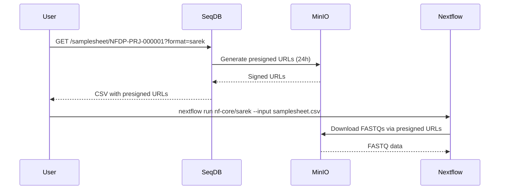
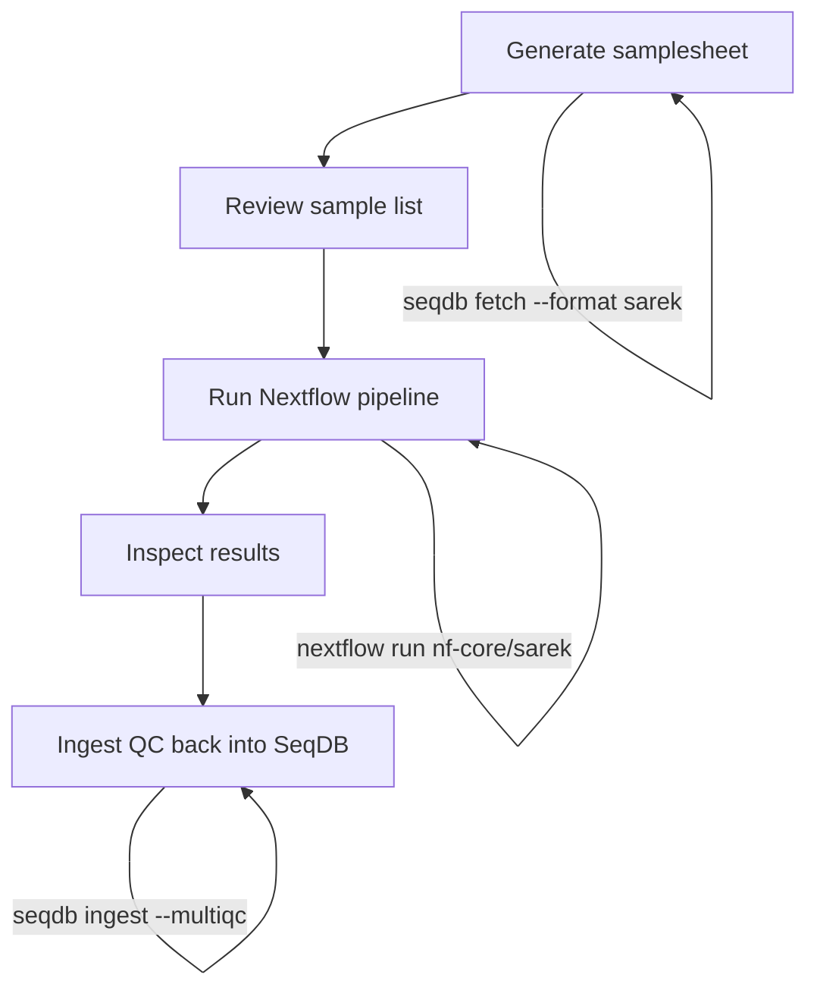

# Samplesheet Generation & Pipeline Integration

SeqDB can generate pipeline-ready samplesheets in CSV format, tailored to
specific nf-core workflows. Instead of manually assembling sample metadata and
file paths, you request a samplesheet for a project and receive a file that
Nextflow can consume directly.

!!! tip "Two ways to get samplesheets"
    You can use either the **REST endpoint** (`GET /api/v1/samplesheet/...`) or
    the **CLI** (`seqdb fetch --format ...`). Both produce the same output.

---

## Available Formats

| Format     | Target Pipeline          | Key Columns                                                        |
|------------|--------------------------|--------------------------------------------------------------------|
| `fetchngs` | Any (generic fetch)     | `sample`, `fastq_1`, `fastq_2`                                    |
| `sarek`    | nf-core/sarek            | `patient`, `sample`, `lane`, `fastq_1`, `fastq_2`                 |
| `rnaseq`   | nf-core/rnaseq           | `sample`, `fastq_1`, `fastq_2`, `strandedness`                    |
| `snpchip`  | Genotyping workflows     | `sample`, `organism`, `tax_id`, `breed`, `sex`, `instrument_model`, `idat_red`, `idat_grn`, `genotype_file` |
| `generic`  | Custom / data export     | All metadata columns (accessions, organism, platform, file info, `download_url`) |

---

## REST Endpoint

**URL** `GET /api/v1/samplesheet/{project}?format={format}`

| Parameter | Required | Default   | Description                               |
|-----------|----------|-----------|-------------------------------------------|
| `project` | yes      | --        | Project accession (e.g. `NFDP-PRJ-000001`)|
| `format`  | no       | `generic` | One of `fetchngs`, `sarek`, `rnaseq`, `snpchip`, `generic` |

The response `Content-Type` is `text/csv` with an appropriate
`Content-Disposition` header for file download.

---

## Format Details

### fetchngs

The simplest format. Works as input for nf-core/fetchngs or any pipeline that
accepts paired-end FASTQ paths.

**Columns:** `sample`, `fastq_1`, `fastq_2`

```csv
sample,fastq_1,fastq_2
NFDP-SAM-000001,https://minio.nfdp.org/seqdb/reads/SAM000001_R1.fastq.gz?X-Amz-Expires=86400&...,https://minio.nfdp.org/seqdb/reads/SAM000001_R2.fastq.gz?X-Amz-Expires=86400&...
NFDP-SAM-000002,https://minio.nfdp.org/seqdb/reads/SAM000002_R1.fastq.gz?X-Amz-Expires=86400&...,https://minio.nfdp.org/seqdb/reads/SAM000002_R2.fastq.gz?X-Amz-Expires=86400&...
```

```bash
# Download the samplesheet
curl -s -H "Authorization: Bearer $TOKEN" \
  "https://seqdb.nfdp.org/api/v1/samplesheet/NFDP-PRJ-000001?format=fetchngs" \
  -o samplesheet.csv
```

```bash
# Run any pipeline that accepts sample,fastq_1,fastq_2
nextflow run nf-core/fetchngs -r 1.12.0 \
  --input samplesheet.csv \
  --outdir results/ \
  -profile singularity
```

---

### sarek

Designed for nf-core/sarek, the variant calling pipeline. Adds `patient` and
`lane` columns required by sarek's input schema.

**Columns:** `patient`, `sample`, `lane`, `fastq_1`, `fastq_2`

```csv
patient,sample,lane,fastq_1,fastq_2
NFDP-SAM-000001,NFDP-SAM-000001_T,L001,https://minio.nfdp.org/seqdb/reads/SAM000001_L001_R1.fastq.gz?...,https://minio.nfdp.org/seqdb/reads/SAM000001_L001_R2.fastq.gz?...
NFDP-SAM-000001,NFDP-SAM-000001_T,L002,https://minio.nfdp.org/seqdb/reads/SAM000001_L002_R1.fastq.gz?...,https://minio.nfdp.org/seqdb/reads/SAM000001_L002_R2.fastq.gz?...
```

```bash
curl -s -H "Authorization: Bearer $TOKEN" \
  "https://seqdb.nfdp.org/api/v1/samplesheet/NFDP-PRJ-000001?format=sarek" \
  -o samplesheet_sarek.csv
```

```bash
nextflow run nf-core/sarek -r 3.5.1 \
  --input samplesheet_sarek.csv \
  --genome ICSAG_CamDro3 \
  --tools haplotypecaller,vep \
  --outdir results/ \
  -profile singularity
```

!!! note "Multi-lane samples"
    If a sample was sequenced across multiple lanes, each lane appears as a
    separate row. Sarek merges them automatically during alignment.

---

### rnaseq

Formatted for nf-core/rnaseq with the required `strandedness` column.

**Columns:** `sample`, `fastq_1`, `fastq_2`, `strandedness`

```csv
sample,fastq_1,fastq_2,strandedness
NFDP-SAM-000010,https://minio.nfdp.org/seqdb/reads/SAM000010_R1.fastq.gz?...,https://minio.nfdp.org/seqdb/reads/SAM000010_R2.fastq.gz?...,reverse
NFDP-SAM-000011,https://minio.nfdp.org/seqdb/reads/SAM000011_R1.fastq.gz?...,https://minio.nfdp.org/seqdb/reads/SAM000011_R2.fastq.gz?...,reverse
```

```bash
curl -s -H "Authorization: Bearer $TOKEN" \
  "https://seqdb.nfdp.org/api/v1/samplesheet/NFDP-PRJ-000003?format=rnaseq" \
  -o samplesheet_rnaseq.csv
```

```bash
nextflow run nf-core/rnaseq -r 3.17.0 \
  --input samplesheet_rnaseq.csv \
  --genome GRCh38 \
  --outdir results/ \
  -profile singularity
```

!!! tip "Strandedness detection"
    SeqDB infers strandedness from the library preparation metadata stored in
    each experiment record. If strandedness is unknown, the value defaults to
    `unstranded` and nf-core/rnaseq will auto-detect it.

---

### snpchip

For genotyping array data. Includes columns for IDAT files and genotype call
files.

**Columns:** `sample`, `organism`, `tax_id`, `breed`, `sex`,
`instrument_model`, `idat_red`, `idat_grn`, `genotype_file`

```csv
sample,organism,tax_id,breed,sex,instrument_model,idat_red,idat_grn,genotype_file
NFDP-SAM-000050,Camelus dromedarius,9838,Majaheem,female,Illumina BovineHD,https://minio.nfdp.org/.../SAM050_Red.idat?...,https://minio.nfdp.org/.../SAM050_Grn.idat?...,https://minio.nfdp.org/.../SAM050.gtc?...
NFDP-SAM-000051,Camelus dromedarius,9838,Wadah,male,Illumina BovineHD,https://minio.nfdp.org/.../SAM051_Red.idat?...,https://minio.nfdp.org/.../SAM051_Grn.idat?...,https://minio.nfdp.org/.../SAM051.gtc?...
```

```bash
curl -s -H "Authorization: Bearer $TOKEN" \
  "https://seqdb.nfdp.org/api/v1/samplesheet/NFDP-PRJ-000005?format=snpchip" \
  -o samplesheet_snpchip.csv
```

---

### generic

Exports all available metadata. Useful for custom pipelines, data audits, or
when you need the full picture.

**Columns:** `project_accession`, `sample_accession`, `experiment_accession`,
`run_accession`, `organism`, `tax_id`, `breed`, `sex`, `tissue`,
`library_strategy`, `library_source`, `library_selection`, `platform`,
`instrument_model`, `file_type`, `file_name`, `file_size`, `file_md5`,
`download_url`

```bash
curl -s -H "Authorization: Bearer $TOKEN" \
  "https://seqdb.nfdp.org/api/v1/samplesheet/NFDP-PRJ-000001?format=generic" \
  -o full_metadata.csv
```

!!! note "Column count"
    The generic format can have 19+ columns. Open with a spreadsheet
    application or use `csvtool` / `csvkit` for command-line inspection.

---

## CLI Alternative

The `seqdb fetch` command wraps the samplesheet endpoint and can optionally
download the referenced files to local disk.

```bash
# Generate samplesheet only (same as the REST endpoint)
seqdb fetch NFDP-PRJ-000001 --format sarek -o ./data/samplesheet.csv

# Generate samplesheet and download all referenced FASTQ files
seqdb fetch NFDP-PRJ-000001 --format sarek -o ./data/

# Print download URLs without fetching files
seqdb fetch NFDP-PRJ-000001 --format generic --urls-only
```

!!! warning "Presigned URL expiry"
    Download URLs in the samplesheet are **presigned MinIO URLs** valid for
    **24 hours**. If you generate a samplesheet but run the pipeline later,
    regenerate the samplesheet to get fresh URLs.

---

## Download URLs

Every `fastq_1`, `fastq_2`, `idat_*`, `genotype_file`, and `download_url`
column contains a presigned MinIO URL.

Key properties:

- **Expiry:** 24 hours from generation time
- **Access:** No additional authentication required (the signature is embedded)
- **Nextflow compatibility:** Nextflow can fetch these URLs directly -- no
  staging step needed
- **Regeneration:** Request the samplesheet again to get fresh URLs



---

## End-to-End Workflow

A typical bioinformatics workflow using samplesheets:



### Step-by-step

```bash
# 1. Generate samplesheet
seqdb fetch NFDP-PRJ-000001 --format sarek -o ./samplesheet.csv

# 2. Review
column -t -s, ./samplesheet.csv | head -20

# 3. Run pipeline
nextflow run nf-core/sarek -r 3.5.1 \
  --input ./samplesheet.csv \
  --genome ICSAG_CamDro3 \
  --outdir ./results/ \
  -profile singularity

# 4. Ingest QC results back into SeqDB
seqdb ingest NFDP-PRJ-000001 --multiqc ./results/multiqc/multiqc_data/
```

!!! tip "Closing the loop"
    Ingesting MultiQC results back into SeqDB links QC metrics to the original
    samples, making them searchable and visible in the web dashboard.

---

## Samplesheet Endpoint vs. Filereport Endpoint

SeqDB offers two ways to export project data. Choose based on your use case.

| Feature                 | `/samplesheet/{project}`         | `/filereport/{project}` (if available) |
|-------------------------|----------------------------------|----------------------------------------|
| **Output format**       | CSV                              | JSON                                   |
| **Purpose**             | Pipeline input                   | Programmatic data access               |
| **Format parameter**    | `fetchngs`, `sarek`, `rnaseq`, `snpchip`, `generic` | N/A                 |
| **Includes file URLs**  | Yes (presigned)                  | Yes (presigned)                        |
| **Column selection**    | Fixed per format                 | All fields                             |
| **Best for**            | Nextflow / Snakemake workflows   | Custom scripts, dashboards             |

---

## Troubleshooting

| Problem                          | Cause                           | Solution                                  |
|----------------------------------|---------------------------------|-------------------------------------------|
| Empty samplesheet (header only)  | No runs in project yet          | Check project status: `seqdb status NFDP-PRJ-000001` |
| `403 Forbidden`                  | Token expired or wrong project  | Run `seqdb login` to refresh credentials  |
| Pipeline fails to download files | Presigned URLs expired           | Regenerate samplesheet for fresh URLs     |
| Missing `strandedness` column    | Wrong format requested           | Use `--format rnaseq` for nf-core/rnaseq  |
| Unexpected column names          | Format mismatch                  | Check `--format` matches your pipeline    |
