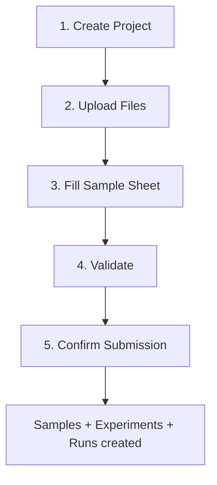

# Submitting Data

This guide walks through the full data submission workflow using the web interface.

## Submission overview

The SeqDB follows the ENA data model hierarchy:



## Step 1: Create or select a project

A **project** groups related samples under a single study. Every submission belongs to a project.

1. Navigate to **Submit** → **Bulk Submit**
2. Choose **Create New** or **Select Existing**
3. For new projects, fill in:
    - **Title** — Short descriptive name (e.g., "Arabian Camel WGS 2026")
    - **Project Type** — Select from: `WGS`, `Metagenomics`, `Transcriptomics`, `Genotyping`, `Amplicon`, `Other`
    - **Description** — Optional but recommended for FAIR compliance
4. Click **Next**

!!! tip "FAIR Tip"
    Adding a description and release date improves your project's Findability score.

## Step 2: Upload sequencing files

Files must be staged before they can be linked to samples.

### Browser upload

1. Click **Choose Files** to select FASTQ, BAM, or CRAM files
2. Files are uploaded directly to the staging area
3. MD5 checksums are computed server-side automatically
4. Wait for the upload to complete (progress bar shown)

### FTP upload (large files)

For files larger than 5 GB, use FTP:

1. Connect to the FTP server: `ftp://ftp.seqdb.nfdp.dev`
2. Log in with your SeqDB credentials
3. Upload files to your user directory
4. Files appear in the staging area automatically

See [File Staging & Upload](file-upload.md) for more details.

!!! note "Already staged?"
    If files were uploaded in a previous session, click **Skip** to proceed directly to the sample sheet step.

## Step 3: Fill the sample sheet

The sample sheet is a TSV (tab-separated values) file that maps samples to sequencing files.

1. Select a **metadata checklist** (e.g., ERC000011 — ENA Default)
2. Click **Download Template** to get a pre-filled template with demo data
3. Open the template in Excel or Google Sheets
4. Replace the demo rows with your actual sample metadata
5. Save as `.tsv` (tab-separated)
6. Click **Upload Filled Sheet**

### Required columns

Every sample sheet must include:

| Column | Description | Example |
|--------|-------------|---------|
| `sample_alias` | Unique identifier per sample | `CAMEL_001` |
| `organism` | Species name | `Camelus dromedarius` |
| `tax_id` | NCBI taxonomy ID | `9838` |

Additional required fields depend on the selected checklist.

### File matching columns

| Column | Description |
|--------|-------------|
| `filename_forward` | Forward read filename (R1) |
| `filename_reverse` | Reverse read filename (R2) |
| `md5_forward` | MD5 checksum of forward file (optional) |
| `md5_reverse` | MD5 checksum of reverse file (optional) |

!!! info "Smart file matching"
    The system matches files using a 3-tier fallback:

    1. **Exact filename** — Matches `filename_forward` against staged files
    2. **MD5 checksum** — If filename not found, matches by MD5
    3. **Alias pattern** — Falls back to `{sample_alias}_R1.*` / `{sample_alias}_R2.*`

    If no match is found, the system suggests the closest match: *"Did you mean 'SAMPLE_001_R1.fastq.gz'?"*

## Step 4: Review validation

After uploading the sample sheet, a validation preview appears:

- **Green cells** — Field is filled and valid
- **Yellow cells** — Optional field is empty (OK to proceed)
- **Red cells** — Required field is missing (must fix)
- Column headers marked with ***** are required

Fix any errors in your TSV file and re-upload.

## Step 5: Confirm

Once validation passes:

1. Review the summary table showing all samples and matched files
2. Click **Confirm & Create All**
3. The system creates:
    - One **Sample** per row
    - One **Experiment** per sample (with platform/library info)
    - One **Run** per matched file (with checksum and file path)

After confirmation, you'll see the created accession numbers and can view them on the project detail page.

## After submission

- View your project at `/projects/{accession}`
- Check FAIR compliance score and suggestions
- Download files via the API: `GET /api/v1/filereport?accession={project_accession}`
- Add more samples later via the project's **Bulk Upload** button

## CLI Submission

The same workflow can be performed entirely from the command line using the `seqdb` CLI.

### Install and authenticate

```bash
pip install seqdb-cli
seqdb login --url https://api.seqdb.nfdp.dev --email you@example.com
```

### Download a checklist template

```bash
seqdb template ERC000011 --output my_samples.tsv
```

### Upload files and submit

```bash
# Upload FASTQ files to staging and submit metadata in one command
seqdb submit my_samples.tsv \
  --checklist ERC000011 \
  --project NFDP-PRJ-000001 \
  --files ./reads/ \
  --threads 8
```

Add `--yes` to skip the interactive confirmation prompt.

### Check submission status

```bash
seqdb status NFDP-PRJ-000001
```

See the [CLI Reference](cli.md) for the full list of options.
